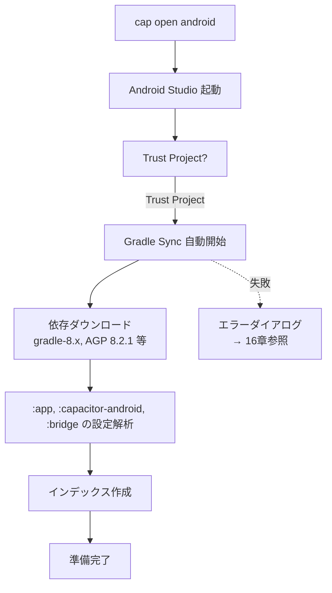
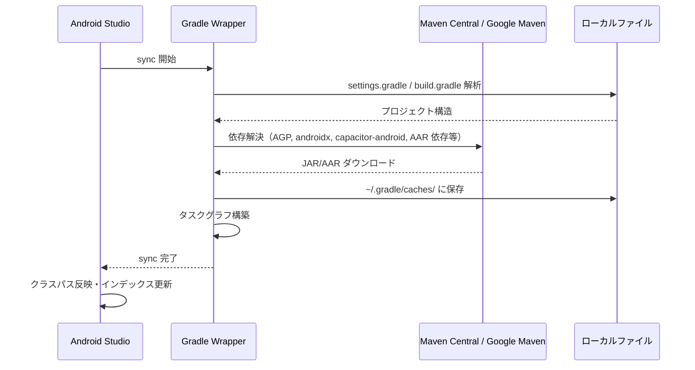
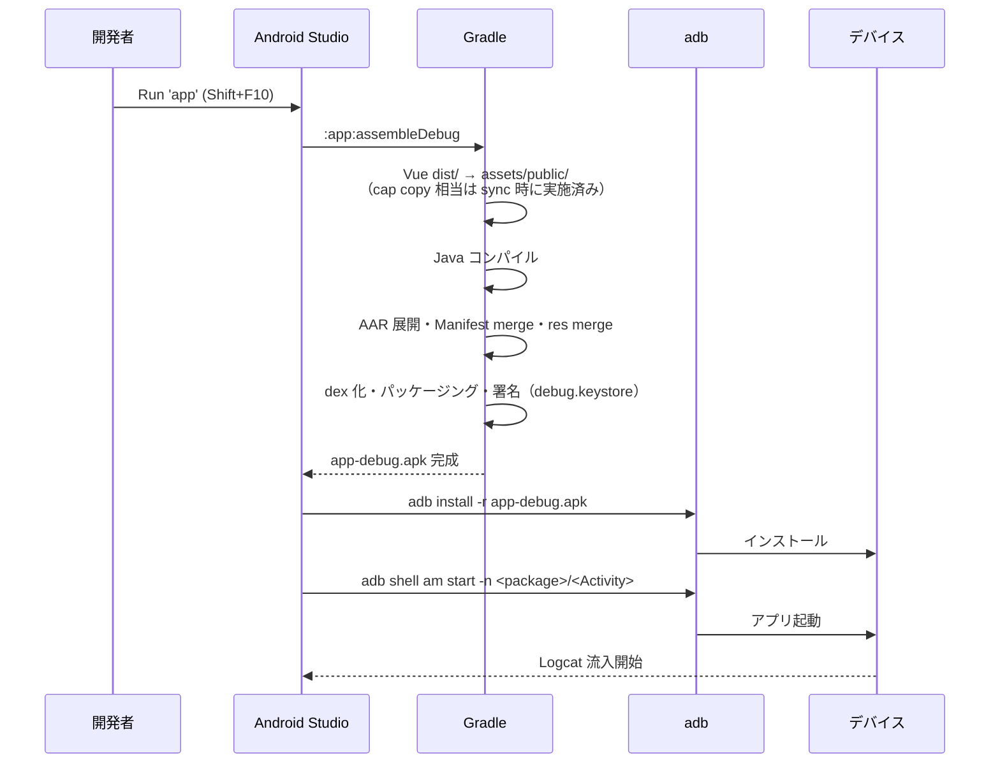
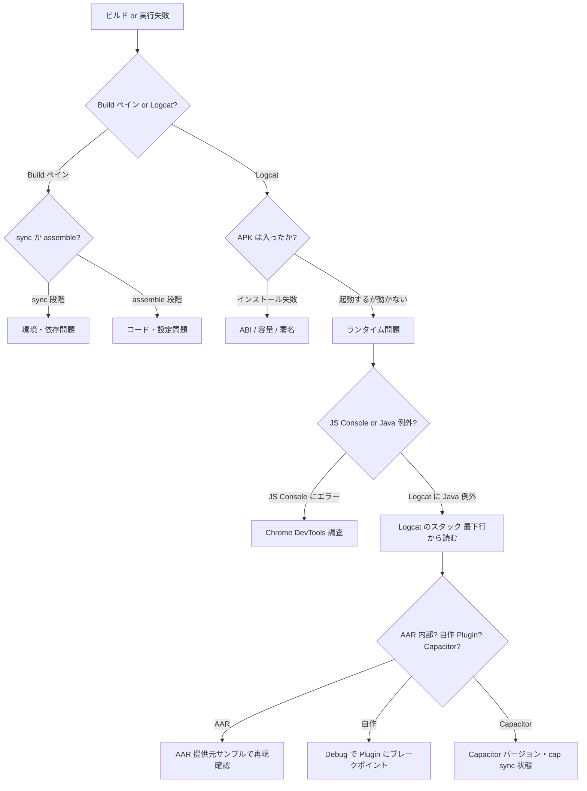

# Android Studio ビルドガイド（Ionic + Capacitor + bridge）

## 本書の位置づけ

調査資料 [`2026-04-20-mobile-app-poc-bridge-investigation.md`](./2026-04-20-mobile-app-poc-bridge-investigation.md) の **第6章・第8章の Android Studio 操作面を深掘り**したガイド。

- **対象**: frontend（Ionic + Vue + Capacitor）の Android プロジェクトを Android Studio で扱う人
- **前提**: bridge は `@capacitor/cli plugin:generate` 済みで frontend に依存として入っている前提
- **カバー範囲**: Android Studio の UI 操作、Gradle sync、ビルドバリアント、実行、デバッグ、Logcat、APK 解析、署名、Live Reload、よくあるエラー
- **非カバー**: Android Studio の汎用機能解説（公式ドキュメント参照）、iOS/Xcode

## 目次

- [1. セットアップ](#1-セットアップ)
- [2. プロジェクトを Android Studio で開く](#2-プロジェクトを-android-studio-で開く)
- [3. プロジェクト構造の見方](#3-プロジェクト構造の見方)
- [4. Gradle Sync の理解](#4-gradle-sync-の理解)
- [5. ビルドバリアント（debug / release）](#5-ビルドバリアントdebug--release)
- [6. 実機とエミュレータ](#6-実機とエミュレータ)
- [7. ビルドと実行](#7-ビルドと実行)
- [8. Live Reload を Android Studio で使う](#8-live-reload-を-android-studio-で使う)
- [9. Logcat の使い方](#9-logcat-の使い方)
- [10. デバッグ（Java側）](#10-デバッグjava側)
- [11. JS 側のデバッグとの連携](#11-js-側のデバッグとの連携)
- [12. APK の解析](#12-apk-の解析)
- [13. Gradle タスクの直接実行](#13-gradle-タスクの直接実行)
- [14. 署名とリリースビルド](#14-署名とリリースビルド)
- [15. プロファイリング](#15-プロファイリング)
- [16. よくあるエラーと対処](#16-よくあるエラーと対処)
- [17. Windows 固有 TIPS](#17-windows-固有-tips)
- [付録: キーボードショートカット早見表](#付録-キーボードショートカット早見表)

---

## 1. セットアップ

### 1.1 バージョン要件（Capacitor 6 の場合）

| 項目 | 要件 | 備考 |
|---|---|---|
| Android Studio | Hedgehog (2023.1.1) 以降 | AGP 8.2.1 をサポートするバージョン以上。Ladybug / Koala 等の後継でも可 |
| JDK | 17 | Capacitor 6 / AGP 8.2.1 の要件。Android Studio 内蔵の JBR 17 を使うのが最も安定 |
| Android SDK Platform | API 34（compileSdk）/ API 22 以上（minSdk） | bridge / frontend の `variables.gradle` と合わせる |
| Android SDK Build-Tools | 34.x.x | SDK Manager で最新をインストール |
| Gradle | 8.2+ | Gradle Wrapper 経由、手動インストール不要 |
| Capacitor | 6.x | frontend の `package.json` |

### 1.2 JDK の設定

Android Studio 内蔵 JBR（JetBrains Runtime）を使うのが最も安全:

```
File → Settings → Build, Execution, Deployment → Build Tools → Gradle
  Gradle JDK: jbr-17 (Embedded)
```

**外部 JDK を使う場合**:
- `JAVA_HOME` を JDK 17 に設定（OS 環境変数）
- VS Code / コマンドライン (`gradlew`) から使うとき用

確認:

```powershell
java -version        # 17.x.x が出ればOK
javac -version       # 17.x.x が出ればOK
echo %JAVA_HOME%     # JDK 17 の path
```

### 1.3 Android SDK Manager で最低限入れるもの

`Tools → SDK Manager`:

- **SDK Platforms** タブ:
  - `Android 14.0 (API 34)` — Show Package Details にチェックして以下を選択:
    - Android SDK Platform 34
    - Google APIs ARM 64 v8a System Image（エミュレータ使う場合）
- **SDK Tools** タブ:
  - Android SDK Build-Tools 34.0.0
  - Android SDK Command-line Tools (latest)
  - Android SDK Platform-Tools
  - Android Emulator（エミュレータ使う場合）
  - Google USB Driver（Windows で実機使う場合）
  - Intel x86 Emulator Accelerator (HAXM) / Android Emulator hypervisor driver（AMD の場合）

### 1.4 環境変数

Windows ユーザー環境変数:

| 変数 | 値 |
|---|---|
| `JAVA_HOME` | `C:\Program Files\Android\Android Studio\jbr`（JBR を使う場合） |
| `ANDROID_HOME` | `%LOCALAPPDATA%\Android\Sdk` |
| `PATH` 追加 | `%ANDROID_HOME%\platform-tools`, `%ANDROID_HOME%\emulator`, `%JAVA_HOME%\bin` |

確認:

```powershell
adb version
emulator -version
```

---

## 2. プロジェクトを Android Studio で開く

### 2.1 正しいディレクトリを開く

Ionic + Capacitor プロジェクトで Android Studio が開くべきは `<frontend>/android/` **の中身**。

| 誤 | 正 |
|---|---|
| ❌ `mobile-app-poc-frontend/` をルートで開く | ✅ `mobile-app-poc-frontend/android/` を開く |
| ❌ File → Open → frontend | ✅ File → Open → frontend/android |

**推奨コマンド**:

```bash
cd mobile-app-poc-frontend
npx cap open android
```

`cap open android` が自動で `frontend/android/` を Android Studio で開いてくれる。Android Studio が起動していなければ起動させる。

### 2.2 初回起動のフロー



初回は **10〜30分**かかることがある（Gradle / AGP / 依存の初回 DL）。画面下の Progress Bar で進捗が見える。

### 2.3 Trust Project とは

Android Studio (IntelliJ) のセキュリティ機能。初回プロジェクトを開く際、build スクリプトを実行しても安全かを確認される。自分のプロジェクトなら **Trust Project** を選ぶ。

---

## 3. プロジェクト構造の見方

### 3.1 プロジェクトビューの切替

左ペイン（Project ツール）の上部ドロップダウンから切替:

| ビュー | 特徴 | いつ使う |
|---|---|---|
| **Android** | Android 開発者向けに整理された仮想的ツリー。`manifests/`, `java/`, `res/` 等で分類 | 普段使い |
| **Project** | ディスク上の実際のディレクトリ構造 | ファイル位置を正確に把握したい時 |
| **Packages** | Java パッケージ単位 | クラス探す時 |

本ガイドでは **Android ビュー** を基本とする。

### 3.2 Android ビューで見えるモジュール

```
frontend/android (root)
├─ app                             ← メインのアプリモジュール :app
│  ├─ manifests/
│  │  └─ AndroidManifest.xml       ← frontend 側の Manifest
│  ├─ java/
│  │  ├─ io.ionic.starter          ← MainActivity.java
│  │  └─ io.ionic.starter (androidTest)
│  ├─ res/
│  └─ Gradle Scripts 以下に build.gradle
├─ capacitor-android               ← @capacitor/android （:capacitor-android）
│  └─ java/com.getcapacitor/*.java
├─ mobile-app-poc-bridge           ← 自作 bridge （:mobile-app-poc-bridge）
│  ├─ manifests/AndroidManifest.xml
│  ├─ java/com.example.bridge/
│  │  └─ DeviceBridgePlugin.java
│  └─ libs/*.aar                    ← AAR がここに見える
└─ Gradle Scripts
   ├─ build.gradle (Project: android)
   ├─ build.gradle (Module: app)
   ├─ build.gradle (Module: mobile-app-poc-bridge)
   ├─ gradle-wrapper.properties
   ├─ proguard-rules.pro (Module: app)
   ├─ capacitor.build.gradle        ← 自動生成、手で触らない
   ├─ capacitor.settings.gradle     ← 自動生成、手で触らない
   ├─ variables.gradle              ← minSdk/compileSdk を変更する場所
   └─ gradle.properties
```

### 3.3 覚えておくべき 5 ファイル

| ファイル | 役割 | 触ってよいか |
|---|---|---|
| `app/build.gradle` | アプリ本体の依存とビルド設定 | ⚠️ 一部のみ（capacitor.build.gradle の import 行は触らない） |
| `variables.gradle` | SDK バージョン一元管理 | ✅ 自由に |
| `app/proguard-rules.pro` | release ビルドの難読化ルール | ✅ AAR 保護等を追加 |
| `app/src/main/AndroidManifest.xml` | frontend の Manifest | ✅ 権限追加等 |
| `capacitor.build.gradle` / `capacitor.settings.gradle` | Plugin 接続の配管 | ❌ `cap sync` が自動生成。手で触ると次の sync で消える |

### 3.4 bridge モジュールに入れるファイル

bridge 開発者は `mobile-app-poc-bridge` モジュール配下を編集:

- Java/Kotlin 実装: `java/com.example.bridge/DeviceBridgePlugin.java`
- AAR: `libs/*.aar`
- ビルド設定: `build.gradle (Module: mobile-app-poc-bridge)`

**注意**: これは `node_modules/mobile-app-poc-bridge/android/` への参照。編集は bridge リポジトリ本体に反映しないと `cap sync` で上書きされる。実際の開発手順は [第4章の「ローカル参照」方式](./2026-04-20-mobile-app-poc-bridge-investigation.md#第4章-bridge-を-frontend-へ取り込む3方式)を参照。

---

## 4. Gradle Sync の理解

### 4.1 Sync が走るタイミング

- プロジェクトを開いた時（初回）
- `*.gradle` / `*.properties` を編集・保存した時
- `variables.gradle` を変更した時
- プロジェクトビュー上部の **"Sync Now"** リンクをクリックした時
- `File → Sync Project with Gradle Files` (Ctrl+Shift+O)

### 4.2 Sync が何をやるか



### 4.3 Sync に失敗した時の読み方

右下の "Build" ウィンドウにエラーが出る。読むポイント:

- **最後のエラーメッセージ**から読む（スタックトレースの上ではなく下）
- `Could not resolve ...` → ネットワーク・プロキシ問題
- `Could not find method ...` → AGP バージョン不整合
- `Could not find :mobile-app-poc-bridge` → `npx cap sync android` 未実行

詳細は [16章](#16-よくあるエラーと対処)。

### 4.4 キャッシュクリア

sync が何度も失敗するときの最終手段:

```
File → Invalidate Caches...
  [x] Clear file system cache and Local History
  [x] Clear VCS Log caches and indexes
  → Invalidate and Restart
```

さらに:

```powershell
cd frontend/android
./gradlew --stop          # Gradle Daemon 停止
Remove-Item -Recurse -Force .gradle, build, app/build
```

---

## 5. ビルドバリアント（debug / release）

### 5.1 Build Variants パネル

`View → Tool Windows → Build Variants` でパネルを表示。

|  Module | Active Build Variant | Active ABI |
|---|---|---|
| app | **debug** / release | arm64-v8a 等 |
| mobile-app-poc-bridge | **debug** / release | — |
| capacitor-android | **debug** / release | — |

`:app` を debug に設定すれば、依存する bridge / capacitor-android も debug で合わせてビルドされる。

### 5.2 debug と release の違い

| 項目 | debug | release |
|---|---|---|
| 署名 | debug.keystore（自動） | 自作 keystore 必須 |
| ProGuard / R8 | 無効 | 有効（Manifest または `minifyEnabled true` で） |
| デバッグ情報 | 含む | 剥がれる |
| `applicationIdSuffix` | `.debug` を付けることが多い | なし |
| インストール | Android Studio Run で自動 | `./gradlew assembleRelease` + 手動配布 |
| APK サイズ | 大きい | 小さい |

### 5.3 変数による SDK 切替

`variables.gradle`:

```gradle
ext {
    minSdkVersion = 22
    compileSdkVersion = 34
    targetSdkVersion = 34
    androidxActivityVersion = '1.8.0'
    androidxAppCompatVersion = '1.6.1'
    androidxCoordinatorLayoutVersion = '1.2.0'
    androidxCoreVersion = '1.12.0'
    androidxFragmentVersion = '1.6.2'
    coreSplashScreenVersion = '1.0.1'
    androidxWebkitVersion = '1.9.0'
    junitVersion = '4.13.2'
    androidxJunitVersion = '1.1.5'
    androidxEspressoCoreVersion = '3.5.1'
    cordovaAndroidVersion = '10.1.1'
}
```

AAR が `minSdkVersion 24` を要求してきたら、ここを上げる。

---

## 6. 実機とエミュレータ

### 6.1 エミュレータ作成（AVD Manager）

`Tools → Device Manager → Create Device`:

1. **Category**: Phone（Pixel 7 / Pixel 6 が無難）
2. **System Image**: API 34 の `Google APIs` or `Google Play`
3. **Name**: 任意
4. **Advanced Settings**:
   - RAM: 2048 MB 以上
   - Internal Storage: 4 GB 以上

**ABI の注意**:
- 自作 AAR が `arm64-v8a` のみの場合、エミュレータも **arm64 イメージ**を選ぶ（AMD CPU でも動く、ただし遅い）
- Intel HAXM が入っていれば x86_64 イメージが高速だが AAR が非対応だと実行不能

### 6.2 実機接続（USB デバッグ）

1. 実機の **開発者オプション** を有効化（ビルド番号を 7 回タップ）
2. 開発者オプション → **USB デバッグ** ON
3. USB ケーブルで PC に接続
4. 実機に「USB デバッグを許可しますか？」→ 常に許可 ON + OK
5. Android Studio のデバイス選択ドロップダウンに実機名が出る

確認:

```powershell
adb devices
# List of devices attached
# ABCD1234    device
```

### 6.3 実機接続（Wi-Fi デバッグ、Android 11+）

1. 実機 → 開発者オプション → **ワイヤレスデバッグ** ON
2. ペア設定コードとポートを確認（例: 192.168.1.10:37125）
3. PC:

```powershell
adb pair 192.168.1.10:37125
# 実機に出ているペア設定コードを入力
adb connect 192.168.1.10:<別のport>
```

### 6.4 ターゲットデバイスの選択

ツールバー上部のデバイスドロップダウンで選択。実機・エミュ複数接続時はここで切替。

---

## 7. ビルドと実行

### 7.1 主要コマンド早見表

| 操作 | メニュー / ショートカット | 実行される Gradle タスク |
|---|---|---|
| Make Project | Build → Make Project / Ctrl+F9 | `:app:assembleDebug` 相当（インストールなし） |
| Run 'app' | Run → Run 'app' / Shift+F10 | `assembleDebug` + `installDebug` + launch |
| Debug 'app' | Run → Debug 'app' / Shift+F9 | Run + デバッガアタッチ |
| Clean Project | Build → Clean Project | `clean` |
| Rebuild Project | Build → Rebuild Project | `clean` + `assembleDebug` |
| Generate APK | Build → Build Bundle(s) / APK(s) → Build APK(s) | `assembleDebug` |
| Generate Signed APK | Build → Generate Signed Bundle / APK | `assembleRelease` + 署名 |

### 7.2 Run を押すと何が起きるか



### 7.3 APK の出力先

```
frontend/android/app/build/outputs/apk/debug/app-debug.apk
frontend/android/app/build/outputs/apk/release/app-release-unsigned.apk
```

### 7.4 Instant Run / Apply Changes

Android Studio 3.5+ では **Apply Changes**（雷アイコン）で一部変更を実機へ即時反映:

- **Apply Code Changes (Ctrl+Alt+F10)**: Java コードの変更のみ。Activity 再生成なし。Plugin のメソッド内部変更はこれで十分な場合が多い
- **Apply Changes and Restart Activity (Ctrl+F10)**: Activity は再生成、Application は維持
- **Run (Shift+F10)**: 完全再インストール

**注意**: **AAR 差替えや bridge 新メソッド追加は Apply Changes では足りない**。フル Run 必須。

---

## 8. Live Reload を Android Studio で使う

### 8.1 Live Reload の本質

通常:
```
Vue 変更 → npm run build → cap copy → Android Studio Run → 実機
```

Live Reload:
```
Vue 変更 → Vite dev server (PC) → 実機の WebView が PC の Vite に直接アクセス
```

Vue の HMR が実機で効く。**Native / bridge の変更は反映されない**点に注意。

### 8.2 設定手順

**方法 A: CLI 経由（推奨）**

```bash
cd mobile-app-poc-frontend
ionic cap run android --livereload --external
# または
npx cap run android --livereload --external
```

`--external` は「Vite dev server を LAN 向けに公開（0.0.0.0 で listen）」を意味する。PC の LAN IP（`ipconfig` で確認）が WebView から到達できる必要がある。

内部的に起きること:
1. Vite dev server を `0.0.0.0:8100` で起動
2. `capacitor.config.ts` の `server.url` を一時的に `http://<PCのLAN IP>:8100` に書換え
3. `cap sync` → Android Studio ビルド相当の処理で実機にインストール
4. 実機の WebView が PC の Vite に接続して HMR 受信
5. 終了時に `capacitor.config.ts` を元に戻す

**方法 B: Android Studio 経由（手動ハイブリッド）**

1. 別ターミナルで `ionic serve --external --port 8100` を起動
2. `capacitor.config.ts` を手動編集:
   ```ts
   const config: CapacitorConfig = {
     // ...
     server: {
       url: 'http://192.168.1.100:8100',
       cleartext: true,
     },
   };
   ```
3. `npx cap sync android`
4. Android Studio で Run

実機の WebView が Vite に接続する。**作業終了時に `server.url` を必ず削除**（消し忘れ APK を配布すると他環境で壊れる）。

### 8.3 トラブル: 白画面で固まる

| 原因 | 確認 |
|---|---|
| PC と実機が同一 LAN じゃない | `ping <PCのLAN IP>` を実機側（termux等）で実行 |
| Windows Firewall が 8100 を block | `netsh advfirewall firewall add rule name="Vite" dir=in action=allow protocol=TCP localport=8100` |
| Vite dev server が `localhost` だけで listen | `--external` (= `--host 0.0.0.0`) を忘れてない？ |
| 企業 VPN で LAN が分離 | VPN OFF で再試行 |
| `cleartext: true` 未設定 | http 通信が block されている |

---

## 9. Logcat の使い方

### 9.1 Logcat パネルを開く

`View → Tool Windows → Logcat`（Alt+6）

![Logcat illustration: ペイン左に deviceドロップダウン、右にフィルタ入力、下にログ行]

### 9.2 フィルタ記法

上部の検索バーに以下を入力:

| 入力 | 意味 |
|---|---|
| `package:mine` | 自分がインストールしたアプリ (=:app) のログだけ |
| `tag:Capacitor` | タグが "Capacitor" で始まるログ |
| `level:error` | エラー以上 |
| `message:NullPointerException` | メッセージに NPE を含む |
| `tag~:DeviceSdk\|Capacitor` | 正規表現（AAR 提供元タグと Capacitor 両方） |

組合せ例:

```
package:mine tag:Capacitor level:debug
```

### 9.3 覚えておくべきタグ

| タグ | 出所 |
|---|---|
| `Capacitor` | Capacitor ランタイム。Plugin 呼出し・エラー |
| `Capacitor/Plugin` | Plugin 実行時のログ |
| `Capacitor/Console` | JS の `console.log` が流れてくる |
| `CapacitorWebView` | WebView 側イベント |
| `AndroidRuntime` | Java 例外のスタックトレース |
| `System.err` | Java で `System.err.println` が走った |
| AAR 提供元の独自タグ | AAR 提供元のドキュメント参照 |

### 9.4 ログを保存

Logcat パネル右クリック → `Save As...` で `.txt` 保存。バグ報告に添付。

### 9.5 adb logcat（コマンドライン）

Android Studio が重いときや CI で:

```powershell
adb logcat -s Capacitor:* AndroidRuntime:* System.err:*
adb logcat -v time > logcat.txt
adb logcat -c                  # バッファクリア
```

---

## 10. デバッグ（Java側）

### 10.1 ブレークポイント

Java ソース（`DeviceBridgePlugin.java` 等）の行番号の左をクリック → 赤丸。

### 10.2 Debug で起動

`Run → Debug 'app'` (Shift+F9)。Run と違うのは JVM デバッガを attach してくれる点。

### 10.3 ブレークポイントで止まった後の操作

| 操作 | ショートカット |
|---|---|
| Step Over（次の行） | F8 |
| Step Into（メソッド内） | F7 |
| Step Out（メソッドから抜ける） | Shift+F8 |
| Resume（次のブレークポイントまで） | F9 |
| Stop | Ctrl+F2 |
| Evaluate Expression | Alt+F8 |

**Variables** パネルで変数の中身を確認。`PluginCall` の中身（引数）を確認するには `call` を Evaluate し、`call.getData()` で JSObject を展開。

### 10.4 条件付きブレークポイント

赤丸を右クリック → Condition 欄に `deviceId.equals("ABC")` のような条件を書くと、それが true の時だけ止まる。

### 10.5 Attach Debugger to Android Process

既に起動しているプロセスに後から attach:

`Run → Attach Debugger to Android Process` → プロセス選択。Plugin 側のクラスロードはアプリ起動後なので、attach も有効。

### 10.6 AAR 内部にブレークポイントを張れるか

**原則不可**（ソースがないため）。回避策:

- AAR 提供元がソース jar (`*-sources.jar`) を提供していれば `libs/` に同名で置けば Android Studio が認識
- そうでなければ Plugin 側で `call.getData()` と AAR 呼出し結果を丁寧にログ出し

---

## 11. JS 側のデバッグとの連携

### 11.1 同時に使うツール

1. **Android Studio の Logcat / Debugger** → Java 側
2. **Chrome DevTools (`chrome://inspect`)** → Vue/JS 側

### 11.2 Chrome DevTools の起動手順

1. 実機を USB 接続して `adb devices` で認識済みを確認
2. Chrome のアドレスバーに `chrome://inspect`
3. Devices 一覧に "WebView in <アプリ>" が出るので **inspect**
4. 通常の DevTools が開く

### 11.3 何が見えるか

| タブ | 内容 |
|---|---|
| Elements | WebView 内の DOM |
| Console | `console.log` 出力、JS 例外 |
| Sources | TS ソースマップが効けば `.ts` で表示・ブレークポイント可 |
| Network | `fetch` / `XHR`（※ CapacitorHttp は Native 経由なので表示されない） |
| Application | localStorage / IndexedDB |

### 11.4 TS でブレークポイント

1. Vite dev server でソースマップが有効な状態で Live Reload 実行
2. Chrome DevTools → Sources → `webpack://` or `vite://` 配下に TS ファイル
3. ブレークポイント設置

### 11.5 JS → Native の呼出し追跡

```
JS: DeviceBridge.scan() 呼出し
  ↓ Chrome DevTools Console で「scan called」のログ
  ↓ Logcat で Capacitor/Plugin タグを追う
  ↓ Java ブレークポイントで止まる
  ↓ AAR 呼出し
  ↓ call.resolve
  ↓ Chrome DevTools で Promise resolve
```

**双方のタイムスタンプを並べれば**順序が追える。

---

## 12. APK の解析

### 12.1 APK Analyzer を開く

`Build → Analyze APK...` → `app-debug.apk` を選択。

### 12.2 確認できること

- **AndroidManifest.xml**: 最終マージ結果（frontend + bridge + AAR 統合後）。権限が想定通りか
- **classes.dex / classes2.dex**: dex ツリーを開くとクラス一覧が見える
  - `com.example.bridge.DeviceBridgePlugin` が入っているか
  - AAR 提供元のクラスが入っているか
  - ProGuard 後なら難読化名（a, b, c）に変わっている
- **resources.arsc**: リソース一覧
- **res/**: XML リソース、drawable
- **assets/public/**: Vue ビルド成果物。`index.html` と `assets/*.js/*.css`
- **lib/arm64-v8a/*.so**: AAR 由来のネイティブライブラリ

### 12.3 2 つの APK を比較

`Analyze APK` で 1 つ開いた状態で、右上 `Compare with previous APK`。リリース前後の差分確認に有用。

### 12.4 サイズ問題を見つける

APK Analyzer の右側の Raw File Size / Download Size を見る。重いのが `lib/` なら AAR が大きい。`classes.dex` なら依存過多。`assets/public/` なら Vue の bundle 肥大。

---

## 13. Gradle タスクの直接実行

### 13.1 Gradle パネル

`View → Tool Windows → Gradle`（右端アイコン）。

### 13.2 よく使うタスク

| タスク | 効果 |
|---|---|
| `:app:tasks` | 全タスク一覧 |
| `:app:dependencies` | 依存ツリー。AAR や bridge が正しく参照されているか確認 |
| `:app:assembleDebug` | debug APK ビルド（Run と同じ） |
| `:app:assembleRelease` | release APK ビルド |
| `:app:installDebug` | ビルド + 実機インストール |
| `:app:bundleRelease` | AAB 生成（本 PoC では使わない） |
| `:mobile-app-poc-bridge:assembleDebug` | bridge 単体ビルド（デバッグ用） |
| `clean` | build ディレクトリ消去 |

### 13.3 ターミナルから叩く

```powershell
cd frontend/android
./gradlew :app:assembleDebug
./gradlew :app:dependencies --configuration debugCompileClasspath
./gradlew :app:assembleDebug --scan            # Build Scan 生成（公開 URL に送られる、社内向きではない）
./gradlew :app:assembleDebug --profile          # profile レポートを build/reports/profile/
```

### 13.4 依存ツリーで bridge + AAR を確認

```powershell
./gradlew :app:dependencies --configuration debugCompileClasspath | Select-String -Pattern "bridge|aar"
```

出力例:

```
+--- project :mobile-app-poc-bridge
|    +--- project :capacitor-android
|    +--- files(libs)            ← AAR
```

`files(libs)` が出ていれば AAR が拾われている。

---

## 14. 署名とリリースビルド

### 14.1 debug.keystore（自動）

Android Studio が `~/.android/debug.keystore` を自動生成。debug ビルドはこれで署名。**署名設定不要**。

### 14.2 release keystore の作成

`Build → Generate Signed Bundle / APK → APK → Create new...`:

| 項目 | 値 |
|---|---|
| Key store path | 任意（社内共有ドライブに保管推奨、失うと更新不能） |
| Password | 強固なパスワード |
| Key alias | 例: `mobile-app-poc-release` |
| Validity | 25年 |
| Certificate情報 | 会社情報 |

**重要**: keystore は **バックアップ必須**。再発行すると既存インストールを上書きできない（Android は署名ハッシュで同一アプリを判定）。

### 14.3 release build.gradle 設定

`app/build.gradle`:

```gradle
android {
    signingConfigs {
        release {
            storeFile file("../release.keystore")
            storePassword System.getenv("KEYSTORE_PASSWORD") ?: project.findProperty("KEYSTORE_PASSWORD")
            keyAlias "mobile-app-poc-release"
            keyPassword System.getenv("KEY_PASSWORD") ?: project.findProperty("KEY_PASSWORD")
        }
    }
    buildTypes {
        release {
            signingConfig signingConfigs.release
            minifyEnabled true
            shrinkResources true
            proguardFiles getDefaultProguardFile('proguard-android-optimize.txt'), 'proguard-rules.pro'
        }
    }
}
```

`gradle.properties` か環境変数でパスワードを管理。`build.gradle` に生パスワードを直書きしない。

### 14.4 release ビルドの ProGuard 保護

`app/proguard-rules.pro`:

```proguard
# AAR 提供元のクラスを保護（難読化で消さない）
-keep class <AAR提供元のpackage名>.** { *; }
-dontwarn <AAR提供元のpackage名>.**

# Capacitor Plugin 自作分も保護
-keep class com.example.bridge.** { *; }

# Capacitor Plugin 系（通常は @capacitor/android が持つが念のため）
-keep class com.getcapacitor.** { *; }
-keep @com.getcapacitor.annotation.CapacitorPlugin class * { *; }
```

---

## 15. プロファイリング

### 15.1 Android Profiler

`View → Tool Windows → Profiler`。Run ではなく **Profile 'app'** で起動する必要がある。

セッション:
- **CPU**: メソッド呼出しのトレース。bridge の Java 実行時間を見られる
- **Memory**: ヒープ割当。Listener リーク調査
- **Network**: 実機の HTTP トラフィック（ただし CapacitorHttp は別経路なので注意）
- **Energy**: バッテリー影響

### 15.2 Build Analyzer

`View → Tool Windows → Build → Build Analyzer`。直近ビルドのタスク時間を可視化。何が遅いか・並列化できるかを判定。

---

## 16. よくあるエラーと対処

### 16.1 症状別早見表

| 症状（Build ペイン / Logcat） | 原因 | 対処 |
|---|---|---|
| `Could not find :mobile-app-poc-bridge` | `cap sync` 未実行 or node_modules 破損 | `npm install && npx cap sync android` → Sync Now |
| `SDK location not found` | `local.properties` がない | `android/local.properties` に `sdk.dir=C:\\Users\\<user>\\AppData\\Local\\Android\\Sdk` |
| `Failed to read JDK version` | JDK 設定ミス | Settings → Gradle → Gradle JDK を jbr-17 に |
| `JAVA_HOME is not set` | 環境変数未設定 | システム環境変数に JDK 17 パスを設定 |
| `Unsupported class file major version` | 古い JDK で compile | JDK 17 に切替 |
| `Duplicate class com.example.Foo` | AAR と他依存で衝突 | `exclude group` 追加 |
| `Manifest merger failed` | AAR Manifest と frontend が競合 | merged_manifests を見て `tools:replace` で対処 |
| `AAPT2: resource xxx collision` | AAR res と frontend res の名前衝突 | res に prefix 付与、AAR 提供元に連絡 |
| `INSTALL_FAILED_NO_MATCHING_ABIS` | AAR が要求する ABI とデバイスの ABI 不一致 | 実機へ / `abiFilters` 調整 |
| `INSTALL_FAILED_INSUFFICIENT_STORAGE` | デバイス容量不足 | 不要アプリ削除 |
| `INSTALL_FAILED_UPDATE_INCOMPATIBLE` | 署名が違う既存バージョンが入っている | 実機でアンインストールしてから再 install |
| `Plugin not implemented: DeviceBridge` | `cap sync` 後のビルド反映忘れ or 名前不一致 | Rebuild + 再 install。`@CapacitorPlugin(name="DeviceBridge")` と TS の `registerPlugin("DeviceBridge")` 一致確認 |
| `NoClassDefFoundError` at runtime | ProGuard で AAR クラス削除 | proguard-rules.pro に keep 追加 |
| `OutOfMemoryError` at Gradle | Gradle JVM ヒープ不足 | `gradle.properties` に `org.gradle.jvmargs=-Xmx4096m -XX:MaxMetaspaceSize=1024m` |
| Gradle sync が永久に走る | IDE キャッシュ破損 | File → Invalidate Caches → Restart |
| `ZipException: Not in GZIP format` | 依存 DL 中に切断 | `~/.gradle/caches/` の該当 AAR を消して再 sync |
| `adb not recognized` | PATH に platform-tools なし | 環境変数 PATH に追加 |
| Live Reload で白画面 | 実機→PC 到達不可 | 同一LAN確認、FW許可、`--external` 指定 |
| 白画面（debug は OK、release で） | ProGuard で Vue bundle の何かが削除 | 該当クラスを keep |

### 16.2 原因特定フロー



---

## 17. Windows 固有 TIPS

### 17.1 パス長制限（260 文字）

Windows の MAX_PATH 制限に Gradle Cache / node_modules が引っかかる:

```powershell
git config --system core.longpaths true
```

+ `gradle.properties` に:

```properties
org.gradle.daemon=true
org.gradle.jvmargs=-Xmx4096m -XX:MaxMetaspaceSize=1024m
org.gradle.parallel=true
org.gradle.caching=true
android.useAndroidX=true
```

プロジェクトをなるべく短いパス（`C:\ws\` など）に置くのが最もシンプル。

### 17.2 改行コード

`.gitattributes` を必ず配置:

```
*.gradle   text eol=lf
*.properties text eol=lf
```

CRLF が `.gradle` に混入すると "Invalid character" で sync が壊れることがある。

### 17.3 Windows Defender / ウィルス対策

`frontend/node_modules`, `~/.gradle/caches`, `C:\Users\<user>\AppData\Local\Android\Sdk` を除外リストに追加するとビルドが大幅高速化する。

### 17.4 OneDrive 配下を避ける

`C:\Users\<user>\OneDrive\Documents\...` 配下にプロジェクトを置くと OneDrive が裏で同期し、ビルドファイルをロックしたり symlink が壊れる。**OneDrive 外に置く**。

### 17.5 PowerShell 実行ポリシー

```powershell
Set-ExecutionPolicy -Scope CurrentUser RemoteSigned
```

これをしないと `ionic`, `cap`, `npm` のスクリプトが動かないことがある。

### 17.6 ADB ポートがブロックされる

企業 VPN や他アプリ（Hyper-V / Docker Desktop）が ADB の 5037 ポートを奪っていることがある:

```powershell
adb kill-server
netstat -ano | findstr :5037
adb start-server
```

---

## 付録: キーボードショートカット早見表

IntelliJ / Android Studio の既定キーマップ（Windows）。

### ビルド・実行

| 操作 | ショートカット |
|---|---|
| Make Project | Ctrl+F9 |
| Run | Shift+F10 |
| Debug | Shift+F9 |
| Apply Code Changes | Ctrl+Alt+F10 |
| Apply Changes and Restart Activity | Ctrl+F10 |
| Stop | Ctrl+F2 |

### デバッグ

| 操作 | ショートカット |
|---|---|
| Toggle Breakpoint | Ctrl+F8 |
| Step Over | F8 |
| Step Into | F7 |
| Step Out | Shift+F8 |
| Resume Program | F9 |
| Evaluate Expression | Alt+F8 |

### ナビゲーション

| 操作 | ショートカット |
|---|---|
| Go to Class | Ctrl+N |
| Go to File | Ctrl+Shift+N |
| Go to Symbol | Ctrl+Alt+Shift+N |
| Find in Files | Ctrl+Shift+F |
| Go to Declaration | Ctrl+B |
| Go to Implementation | Ctrl+Alt+B |
| Recent Files | Ctrl+E |
| Navigate Back | Ctrl+Alt+Left |

### エディタ

| 操作 | ショートカット |
|---|---|
| Show Intention Actions | Alt+Enter |
| Optimize Imports | Ctrl+Alt+O |
| Reformat Code | Ctrl+Alt+L |
| Rename | Shift+F6 |
| Find Usages | Alt+F7 |
| Surround With | Ctrl+Alt+T |
| Show Parameter Info | Ctrl+P |

### Sync / Tool Windows

| 操作 | ショートカット |
|---|---|
| Sync Project with Gradle Files | Ctrl+Shift+O |
| Project | Alt+1 |
| Run | Alt+4 |
| Debug | Alt+5 |
| Logcat | Alt+6 |
| Terminal | Alt+F12 |

---

## 関連ドキュメント

- [bridge 調査資料本体](./2026-04-20-mobile-app-poc-bridge-investigation.md)
  - 第6章（Gradle ビルドの全体フロー）— 本書と併せて読む
  - 第8章（デバッグ動線）— 3層デバッグツリー
  - 第10章（落とし穴と対策）— 本書16章と併読
- [Capacitor 公式: Android](https://capacitorjs.com/docs/android)
- [Android Studio User Guide](https://developer.android.com/studio/intro)
- [Android Gradle Plugin リリースノート](https://developer.android.com/build/releases/gradle-plugin)

---

*本書は bridge 実装・frontend 統合の進捗に伴って更新される。Android Studio の UI は頻繁に変わるため、メニュー名が変わっていたら都度修正する。*
