# mobile-app-poc-bridge 調査資料

## 本書の位置づけ

本書は `mobile-app-poc-bridge` リポジトリを実装する**前**に、関係者全員が「そもそも何を作ろうとしているのか」「ビルドパイプラインはどう流れるのか」「AAR を JS から呼ぶとはどういうことか」を**図**と**手順**で共有するための調査資料である。

- **設計書 (spec) ではない**。実装計画 (plan) にも繋げない。単体完結の読み物として扱う
- 読者: bridge / frontend 担当者、Capacitor・AAR 初見者を含む
- スコープ: Android のみ・Capacitor 6.x・社内配布前提
- 非スコープ: iOS、具体的 AAR の API 仕様、ビジネスロジック
- 記述方針: 特定ベンダー名は伏せ、「業務用デバイス」「AAR 提供元」と表現。サンプルメソッド名は `scan / connect / disconnect / getStatus` 等の汎用名
- 図は Mermaid（GitHub / VS Code プレビューで表示可）

## 目次

- [第0章: そもそもQ&A（初見者向け基礎）](#第0章-そもそもqa初見者向け基礎)
- [第1章: 前提整理（俯瞰図3枚）](#第1章-前提整理俯瞰図3枚)
- [第2章: bridge リポジトリの構造](#第2章-bridge-リポジトリの構造)
- [第3章: AAR を bridge に組み込む](#第3章-aar-を-bridge-に組み込む)
- [第4章: bridge を frontend へ取り込む（3方式）](#第4章-bridge-を-frontend-へ取り込む3方式)
- [第5章: `npx cap sync` の内部動作](#第5章-npx-cap-sync-の内部動作)
- [第6章: Gradle ビルドの全体フロー](#第6章-gradle-ビルドの全体フロー)
- [第7章: ランタイムシーケンス（JS → Native → AAR）](#第7章-ランタイムシーケンスjs--native--aar)
- [第8章: デバッグ動線](#第8章-デバッグ動線)
- [第9章: バージョン運用と配布](#第9章-バージョン運用と配布)
- [第10章: 落とし穴と対策](#第10章-落とし穴と対策)
- [付録A: 逆引きインデックス](#付録a-逆引きインデックス)
- [付録B: 用語集](#付録b-用語集)
- [付録C: 参考リンク](#付録c-参考リンク)

---

## 第0章: そもそもQ&A（初見者向け基礎）

本編に入る前に、各章の前提となる問いを2〜4行で回答する。詳細は対応章を参照。

### Q0-1. そもそも Capacitor とは何か。Ionic / Cordova との違いは？

**Capacitor** は Ionic Team が開発する **ネイティブ実行ランタイム**。Web 技術（HTML/CSS/JS）で書いたアプリを iOS / Android のネイティブアプリとして動かすための **WebView ラッパー + Plugin 機構** を提供する。

- **Ionic** は UI コンポーネント群（ionic/vue など）。Capacitor とは独立。Ionic 単体では WebView 実行環境は持たない
- **Cordova** は Capacitor の前身的存在。Capacitor は Cordova と互換を持ちつつ、モダンな Plugin API・ネイティブプロジェクトを Git 管理する思想・TypeScript ファーストなどが違い
- 本 PoC では **Ionic（UI）+ Capacitor（ネイティブ実行）** の組合せを採用

### Q0-2. Custom Plugin とは？標準 Plugin と何が違う？

Capacitor の **Plugin** は「JS から呼べるネイティブ機能の束」。

- **標準 Plugin**: `@capacitor/camera`, `@capacitor/geolocation` 等、公式が提供する既成 Plugin。npm install で使える
- **Custom Plugin**: 独自に作る Plugin。今回の bridge がこれ。`npx @capacitor/cli plugin:generate` で雛形を生成して中身を実装する

標準 Plugin で提供されていない業務用デバイス API を JS から呼ぶには Custom Plugin が必要、というのが本 PoC の要点。

→ 詳細: [第2章](#第2章-bridge-リポジトリの構造)

### Q0-3. AAR とは何か？ JAR / Android Library との違いは？

**AAR (Android Archive)** は Android 専用のライブラリ配布形式。`.aar` ファイル 1つに以下が詰まる:

- `classes.jar`（Java クラスファイル）
- `AndroidManifest.xml`（権限やコンポーネント宣言）
- `res/`（リソース: drawable, values 等）
- `proguard.txt`（難読化ルール）
- `jni/`（ネイティブ .so ライブラリ）

**JAR** は Java クラスのみ。AAR は Android 固有リソースを含められる点が決定的な違い。

AAR 提供元は業務用デバイスのドライバや SDK を `.aar` 1 個で配布してくることが多い。本 PoC はこれを Capacitor Plugin に組み込む。

→ 詳細: [第3章](#第3章-aar-を-bridge-に組み込む)

### Q0-4. 「JS から AAR を呼ぶ」とは技術的にどういう仕組みか？

ざっくり **3段橋渡し**。

```
[Vue/TS コード]
   ↓ (TypeScript 関数呼出し)
[Capacitor の JS ブリッジ]  ← JavaScript
   ↓ (WebView → Native のメッセージング)
[Capacitor Android ランタイム]  ← Java
   ↓ (PluginCall オブジェクト経由)
[自作 Plugin クラス（bridge）]  ← Java
   ↓ (通常の Java メソッド呼出し)
[AAR 提供元の SDK クラス]
   ↓ (SDK 内部実装)
[業務用デバイス]
```

JS ↔ Java の越境は Capacitor が抽象化してくれる。開発者が書くのは **TS 側のラッパー**と**Java 側の Plugin クラス**だけ。

→ 詳細: [第7章](#第7章-ランタイムシーケンスjs--native--aar)

### Q0-5. なぜ bridge を frontend と別リポジトリに切るのか？

3点:

1. **再利用性**: bridge は他のモバイルアプリでも流用可能。frontend に直書きすると切り離せない
2. **ビルド時間**: bridge 側のネイティブビルド（Gradle 経由）と frontend の Vite / Vue ビルドは性質が違う。分離するとサイクルタイムが安定
3. **責務分離**: JS-Native 越境の知識を bridge に閉じ込められる。frontend 担当者は TS 側 API だけ見ればよい

→ 詳細: [第4章](#第4章-bridge-を-frontend-へ取り込む3方式)

### Q0-6. ビルドは誰が何をしているのか？ npm と Gradle の役割分担は？

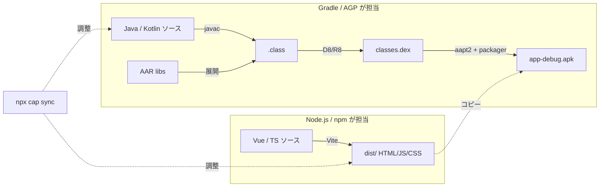

- **npm / Node.js**: Web 側コードのビルド、依存解決、`cap sync` 等のオーケストレーション
- **Gradle / AGP**: Android ネイティブ側のコンパイル、AAR の取り込み、APK の最終生成
- 両者を繋ぐのが **`npx cap sync`**（`cap copy` + `cap update` の合成）

→ 詳細: [第5章](#第5章-npx-cap-sync-の内部動作) / [第6章](#第6章-gradle-ビルドの全体フロー)

### Q0-7. `cap sync` は何のために毎回必要なのか？

Capacitor は Web 側の成果物とネイティブ側のプロジェクトを **別管理**している。Web を変更しても、ネイティブ側に反映されるのは `cap sync` を叩いた瞬間。同様に Plugin（bridge）を追加・更新しても、ネイティブ側の Gradle 設定に登録されるのは `cap sync` 実行時。

つまり:
- **Vue 変更だけ** → Vite HMR（`ionic serve`）でいい
- **bridge 更新・新メソッド追加** → **必ず `cap sync` + Android Studio で再ビルド**

→ 詳細: [第5章](#第5章-npx-cap-sync-の内部動作)

### Q0-8. Logcat とは何か？ Chrome DevTools と何を使い分ける？

- **Chrome DevTools (`chrome://inspect`)**: WebView（=Vue 側）のコンソール、ネットワーク、DOM を見る。JS エラーの調査
- **Logcat**: Android OS 全体のログストリーム。Java 例外、Capacitor ランタイムのログ、AAR 提供元のログを見る

「JS で呼んだはずなのに反応しない」→ まず Chrome DevTools の Console。「Chrome で呼べたが、Native 例外が出てる」→ Logcat。

→ 詳細: [第8章](#第8章-デバッグ動線)

---

## 第1章: 前提整理（俯瞰図3枚）

### 登場するリポジトリ（本書の関心範囲）

| # | リポジトリ | 役割 | 関係 |
|---|---|---|---|
| 1 | mobile-app-poc-bridge | Capacitor Custom Plugin + AAR 組込み | **本書の主題** |
| 2 | mobile-app-poc-frontend | Ionic + Vue + Capacitor、bridge の消費者 | 結合先 |
| 3 | mobile-app-poc-mock | Prism モック API（実行中） | 参考程度 |
| 4 | mobile-app-poc-api-spec | OpenAPI 仕様 | 本書では触れない |
| 5 | mobile-app-poc-backend | Spring Boot API | 本書では触れない |

### 登場ツール早見表

| 分類 | ツール | 役割 |
|---|---|---|
| パッケージ管理 | npm | JS 依存解決、bridge の配布にも使う |
| Capacitor | `@capacitor/cli` | `cap sync` / `cap run` / `plugin:generate` 等を提供 |
| Web ビルド | Vite | Vue ソース → `dist/` |
| Android ビルド | Gradle | Android プロジェクトのビルドランナー |
| AGP | Android Gradle Plugin | Android 特有のビルドロジック（AAR 展開、APK パッケージング）。Capacitor 6 は AGP 8.2.1 |
| JDK | OpenJDK 17+ | Gradle / AGP の実行基盤 |
| IDE | Android Studio | Gradle sync / エミュレータ / Logcat / APK 解析 |
| エディタ | VS Code | TS / Vue 側の編集、`cap sync` 実行 |
| デバイス通信 | ADB | USB/Wi-Fi でデバイスとやり取り |

### 成果物の最終形

APK を解凍 (`unzip app-debug.apk`) したときの中身（要点のみ）:

```
app-debug.apk/
├─ AndroidManifest.xml       # frontend + bridge + AAR の Manifest がマージ済み
├─ classes.dex               # Vue を除く全 Java クラスを dex 化したもの
├─ classes2.dex              # 65K メソッド超でメイン dex に入り切らなかった分
├─ assets/
│  └─ public/                # Vue の Vite ビルド成果物（HTML/JS/CSS）がそのまま
│     ├─ index.html
│     ├─ assets/*.js
│     └─ ...
├─ res/                      # frontend + bridge + AAR のリソースマージ済み
├─ resources.arsc
├─ lib/
│  └─ arm64-v8a/*.so         # AAR 由来のネイティブ .so（業務用デバイスドライバ等）
└─ META-INF/                 # 署名
```

**ポイント**: Vue 成果物は `assets/public/` に**そのまま**入る。AAR の中身は **展開され Manifest/resources/classes/libs にマージされて**最終 APK に溶け込む。

### 俯瞰図 A: 開発時構成

どのリポジトリが何を出力し、どこで合流するか。

```mermaid
flowchart TB
    subgraph bridge[mobile-app-poc-bridge]
        B1[src/index.ts<br/>TS 型定義・エクスポート]
        B2[android/src/.../Plugin.java<br/>Native 実装]
        B3[android/libs/*.aar<br/>業務用デバイス AAR]
        B4[package.json<br/>Plugin メタ]
    end
    subgraph frontend[mobile-app-poc-frontend]
        F1[src/**/*.vue<br/>UI]
        F2[src/api/client.ts<br/>CapacitorHttp]
        F3[android/<br/>Capacitor が生成した Android プロジェクト]
        F4[package.json<br/>bridge を dependency に列挙]
    end
    subgraph mock[mobile-app-poc-mock]
        M1[Prism :4010<br/>http API]
    end
    B4 -->|npm install or file:/git:/tgz| F4
    B1 -->|TS 型として見える| F1
    B2 -.|cap sync で参照| F3
    B3 -.|Gradle で取り込まれる| F3
    F2 -->|HTTP| M1
```

### 俯瞰図 B: ビルド時成果物フロー

AAR が APK に到達するまでの物理パス。

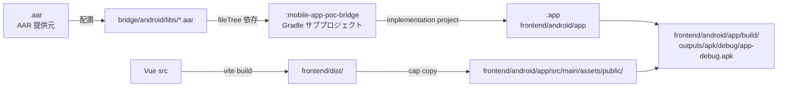

### 俯瞰図 C: ランタイムコール経路

ユーザー操作 → デバイス応答までの経路。

```mermaid
flowchart TB
    U[ユーザー操作<br/>ボタンタップ]
    V[Vue Component]
    J[DeviceBridge.scan<br/>TS ラッパー]
    W[WebView の JS ブリッジ]
    N[Capacitor Android<br/>ランタイム Java]
    P[DeviceBridgePlugin.scan<br/>自作 Plugin Java]
    S[AAR 提供元 SDK]
    D[業務用デバイス]
    U --> V --> J --> W
    W -.postMessage.-> N --> P --> S -.通信.-> D
    D -.応答.-> S --> P -.call.resolve.-> N
    N -.JSON.-> W --> J -.Promise.-> V
```

### 用語集（要点のみ。詳細は [付録B](#付録b-用語集)）

- **PluginCall**: JS からの呼出しを表す Java オブジェクト。引数取得と `resolve/reject` を持つ
- **@CapacitorPlugin**: Plugin クラスに付けるアノテーション。`name` が JS 側識別子になる
- **@PluginMethod**: JS から呼べるメソッドに付けるアノテーション
- **notifyListeners**: Plugin から JS へイベントを push する API
- **Manifest merge**: frontend / bridge / AAR の AndroidManifest.xml を AGP が 1 枚にマージする仕組み

---

## 第2章: bridge リポジトリの構造

### `@capacitor/cli plugin:generate` で生まれるもの

```bash
npx @capacitor/cli plugin:generate
# プロンプトで以下を聞かれる:
#   Plugin npm name          : mobile-app-poc-bridge
#   Plugin id                : com.example.bridge   （Android の package 名）
#   Plugin class name        : DeviceBridge          （Java クラスのプレフィックス）
#   Description, Git, License, Author
```

生成されるディレクトリツリー:

```
mobile-app-poc-bridge/
├─ android/
│  ├─ src/main/java/com/example/bridge/
│  │  └─ DeviceBridgePlugin.java       # @CapacitorPlugin のクラス
│  ├─ src/main/AndroidManifest.xml     # Plugin 側の Manifest（ほぼ空）
│  ├─ build.gradle                     # モジュールビルド設定
│  └─ ProjectSettings.json
├─ ios/                                 # iOS 向け（本 PoC では使わないが生成される）
├─ src/                                  # TS 側
│  ├─ definitions.ts                   # JS から見えるインターフェース
│  ├─ web.ts                            # Web フォールバック実装
│  └─ index.ts                          # エントリポイント、registerPlugin 呼出し
├─ package.json                          # "capacitor": { "android": { "src": "android" }}
├─ MobileAppPocBridge.podspec            # iOS 用（本 PoC では触らない）
├─ rollup.config.mjs                     # TS → JS バンドル設定
├─ tsconfig.json
├─ .gitignore, .npmignore
└─ README.md
```

### Capacitor Plugin が持つ3層

| 層 | ファイル | 役割 |
|---|---|---|
| **1. 契約層 (TS)** | `src/definitions.ts` | JS/TS から見える型定義。`interface DeviceBridgePlugin { scan(): Promise<...> }` |
| **2. Native 実装層** | `android/src/.../DeviceBridgePlugin.java` | 実際のロジック。AAR 呼出しもここ |
| **3. Web フォールバック層** | `src/web.ts` | ブラウザで動かした時のスタブ。Android 実機では使わない |

「frontend 担当者は 1 だけ見ればよい」が設計意図。2 は bridge 担当者が隠蔽する。

### 外部契約と内部実装の分離境界

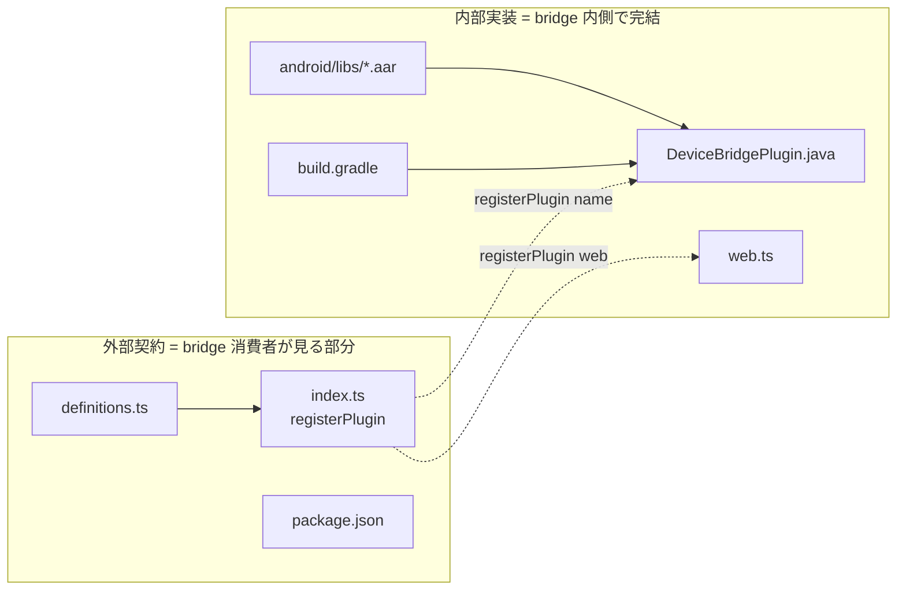

**変更時の波及規則**:
- **外部契約を変える**（メソッド追加、引数変更） → frontend 側も修正必須
- **内部実装だけ変える**（AAR の差替え、バグ修正） → frontend 側は `cap sync` だけで済む

### この章で覚えるべき3点

1. `plugin:generate` は **ひな形生成**であって、ビルドは別途必要
2. **3層構造（TS / Native / Web）**のうち、Android 実機では TS → Native しか通らない
3. `package.json` の `capacitor.android.src` が **Gradle から Android ソースを見つけるための手がかり**

---

## 第3章: AAR を bridge に組み込む

### この章で答える問い

- Q3-1. `.aar` ファイルをどこに置けば bridge から使えるか
- Q3-2. `build.gradle` の 1 行で何が起きているのか
- Q3-3. AAR の中身がどう展開されるか
- Q3-4. AAR が要求する権限・依存は bridge / frontend にどう波及するか

### Q3-1. `.aar` の配置

**`android/libs/` 配下に物理配置**。

```
mobile-app-poc-bridge/
└─ android/
   ├─ libs/
   │  ├─ device-sdk-1.2.3.aar       ← AAR 提供元から受領したもの
   │  └─ device-sdk-dep.aar          ← 依存 AAR があれば複数置ける
   └─ build.gradle
```

注意:
- `libs/` は AGP の慣習的パス。`fileTree(dir: 'libs', ...)` で拾われる
- **ファイル名にバージョンを含める**と後から差替えを追跡しやすい
- `libs/` 自体は Git 管理して良い（社内利用前提のため）。ただし **AAR 提供元のライセンス**は事前確認

### Q3-2. `build.gradle` の 1 行

`mobile-app-poc-bridge/android/build.gradle`（モジュールレベル）:

```gradle
dependencies {
    implementation 'androidx.appcompat:appcompat:1.7.0'
    implementation project(':capacitor-android')

    // ★ AAR 取込み
    implementation fileTree(dir: 'libs', include: ['*.aar'])
}
```

この 1 行で起きること:
1. `libs/` 配下の `*.aar` を Gradle が検出
2. ビルド時に AAR を **展開**（`build/intermediates/aar_extracted/`）
3. 展開物の `classes.jar` を **コンパイルクラスパス**に追加
4. 展開物の `res/`, `AndroidManifest.xml`, `jni/` を **後段タスクの入力**に登録

### Q3-3. AAR の展開物

AAR は実質 ZIP。展開すると以下が現れる:

```
device-sdk-1.2.3.aar/（実体は ZIP）
├─ AndroidManifest.xml      # 権限 <uses-permission>、Service、BroadcastReceiver など
├─ classes.jar              # SDK の Java クラス群
├─ res/                     # リソース（drawable-*, values/strings.xml など）
├─ R.txt                    # リソース ID マッピング
├─ proguard.txt             # 難読化除外ルール（提供元が指定）
├─ libs/                    # AAR 内の追加 JAR 依存
├─ jni/<ABI>/*.so           # ネイティブ .so（arm64-v8a, armeabi-v7a 等）
└─ assets/                  # 任意アセット
```

### 依存グラフ（AAR 取込み後）

```mermaid
flowchart TB
    subgraph bridgeModule[":mobile-app-poc-bridge モジュール"]
        direction TB
        B[DeviceBridgePlugin.java]
        L[libs/device-sdk.aar]
        C[capacitor-android]
    end
    B -->|call| L
    B -->|extends Plugin| C
    L -.AndroidManifest merge.-> MM[Manifest マージ結果]
    L -.res マージ.-> RR[リソースマージ結果]
    L -.classes.jar.-> CP[コンパイルクラスパス]
    L -.jni/*.so.-> NL[ネイティブライブラリ]
```

### Q3-4. 権限・依存の波及

AAR の `AndroidManifest.xml` に書かれた `<uses-permission>` は **自動的に** frontend の最終 APK まで伝播する（Manifest merge）。

ただし **Android 6.0+ の Runtime Permission** は自動付与されない。bridge 側で以下いずれかが必要:

```java
@CapacitorPlugin(
    name = "DeviceBridge",
    permissions = {
        @Permission(strings = { Manifest.permission.BLUETOOTH_CONNECT }, alias = "bluetooth")
    }
)
```

あるいは、Plugin メソッド内で `requestPermissionForAlias(...)` を明示呼出し。

### ありがち落とし穴（第10章でも再掲）

| 症状 | 原因 | 対処 |
|---|---|---|
| `Duplicate class com.example.Foo` | AAR と他依存が同じクラスを持つ | `exclude group:` で片方除外 |
| `INSTALL_FAILED_NO_MATCHING_ABIS` | AAR が `arm64-v8a` のみ対応・エミュレータが x86 | 実機で試す or `abiFilters` 調整 |
| `AAPT2 error: resource collision` | AAR の res/ 名と frontend の res/ が衝突 | リソース名に prefix を付ける |
| `minSdk違反` | AAR が要求する `minSdkVersion` が高い | frontend `android/variables.gradle` で合わせる |

### この章で覚えるべき3点

1. AAR は `android/libs/` に置いて `implementation fileTree(...)` で拾うのが Capacitor Plugin の標準作法
2. AAR は展開されて Manifest・resources・classes・jni に**溶ける**。単なる依存 JAR とは別物
3. 権限は自動波及するが、**Runtime Permission の同意取得は自作が必要**

---

## 第4章: bridge を frontend へ取り込む（3方式）

### この章で答える問い

- Q4-1. frontend から bridge を使うには何をすればいいか
- Q4-2. 社内イントラ前提だと、どの配布方式が現実的か
- Q4-3. 各方式は `node_modules` 内でどう見えるか
- Q4-4. `npm link` はなぜ非推奨か

### Q4-1. 共通の準備（いずれの方式でも必要）

frontend 側の `package.json` に bridge を依存として記載:

```json
{
  "dependencies": {
    "mobile-app-poc-bridge": "<ここを方式別に書き換え>"
  }
}
```

その後 **必ず**:

```bash
npm install              # bridge を node_modules に展開
npx cap sync android      # bridge を Android プロジェクトに登録
```

### Q4-2/Q4-3. 3方式の比較

| 方式 | 記述例 | 反映速度 | 更新手順 | 適性 | node_modules での見え方 |
|---|---|---|---|---|---|
| **A. ローカル参照** | `"file:../mobile-app-poc-bridge"` | 即時 | ソース保存 + `cap sync` | **個人開発・並行修正時** | 実ファイルコピー（npm v7+ は symlink） |
| **B. 社内 git 直参照** | `"git+ssh://internal-git/.../mobile-app-poc-bridge#v0.1.0"` | tag push 後 | `npm install` 再実行 | **チーム共有の標準** | 通常のパッケージ展開 |
| **C. tarball 配布** | `"file:./vendor/mobile-app-poc-bridge-0.1.0.tgz"` | 手動 | tgz 差替え + `npm install` | **オフライン環境** | tarball 展開後の標準形 |

### 方式別 node_modules 到達経路

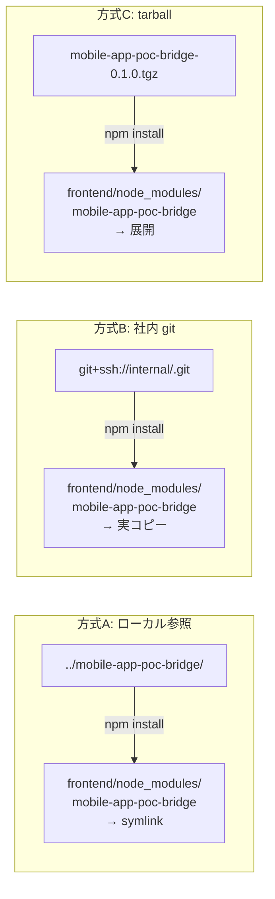

### Q4-4. `npm link` 非推奨の理由

`npm link` は symlink で繋ぐ開発手法だが、Capacitor Android ビルドで以下の問題が出やすい:

- AGP が symlink を辿らず、ソースを見つけられない
- Windows + OneDrive 配下で symlink が壊れる
- `cap sync` が symlink 先を正しく認識しないケースあり

→ **代わりに `file:../mobile-app-poc-bridge` を推奨**。npm v7+ ではこれも symlink 化されるが、`cap sync` との相性が安定している。

### 運用推奨

PoC 期 〜 初期運用:

| フェーズ | 推奨方式 |
|---|---|
| bridge 実装中・frontend と並行修正 | **A. ローカル参照** |
| チームに配布する最初のバージョン | **B. 社内 git 参照（tag ピン留め）** |
| GitHub 到達不能な端末で動かす | **C. tarball 配布**（共有フォルダ経由） |

### キャッシュクリア手順（トラブル時）

```bash
# frontend 側で
rm -rf node_modules package-lock.json
rm -rf android/app/build
rm -rf android/.gradle
npm install
npx cap sync android
# Android Studio で Invalidate Caches も推奨
```

### この章で覚えるべき3点

1. 3方式のうち **A → B の順で移行**するのが PoC の現実解
2. `npm install` の後に `cap sync` を**必ず**叩く
3. `npm link` は使わない。`file:` で事足りる

---

## 第5章: `npx cap sync` の内部動作

### この章で答える問い

- Q5-1. `cap sync` は何をやっているのか
- Q5-2. `cap copy` と `cap update` の違いは
- Q5-3. bridge が「Capacitor に認識される」ための配管はどこにあるか
- Q5-4. `cap sync` を忘れるとどういう症状が出るか

### Q5-1/Q5-2. cap sync の分解

```
npx cap sync android
 ├── cap copy android   # Web 成果物の転送
 │     ├─ frontend/dist/ を
 │     └─ frontend/android/app/src/main/assets/public/ にコピー
 │
 └── cap update android  # ネイティブ側の Plugin 登録更新
       ├─ node_modules/ をスキャン
       ├─ @capacitor/android を検出
       ├─ capacitor Plugin（mobile-app-poc-bridge 等）を検出
       ├─ android/capacitor.settings.gradle を再生成
       │    （include ':capacitor-android', ':mobile-app-poc-bridge' 等）
       └─ android/app/capacitor.build.gradle を再生成
            （implementation project(':capacitor-android') 等）
```

### cap sync 前後のファイル diff

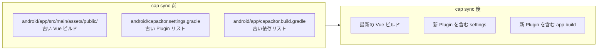

### Q5-3. bridge 認識の配管

**bridge 側**:

```json
// mobile-app-poc-bridge/package.json
{
  "name": "mobile-app-poc-bridge",
  "capacitor": {
    "android": {
      "src": "android"
    }
  }
}
```

**生成される frontend 側** (cap sync が自動書換え):

```gradle
// frontend/android/capacitor.settings.gradle（自動生成、手で触らない）
include ':capacitor-android'
project(':capacitor-android').projectDir = new File('../node_modules/@capacitor/android/capacitor')

include ':mobile-app-poc-bridge'
project(':mobile-app-poc-bridge').projectDir = new File('../node_modules/mobile-app-poc-bridge/android')
```

```gradle
// frontend/android/app/capacitor.build.gradle（自動生成、手で触らない）
dependencies {
    implementation project(':capacitor-android')
    implementation project(':mobile-app-poc-bridge')
}
```

### 登録フロー（図）

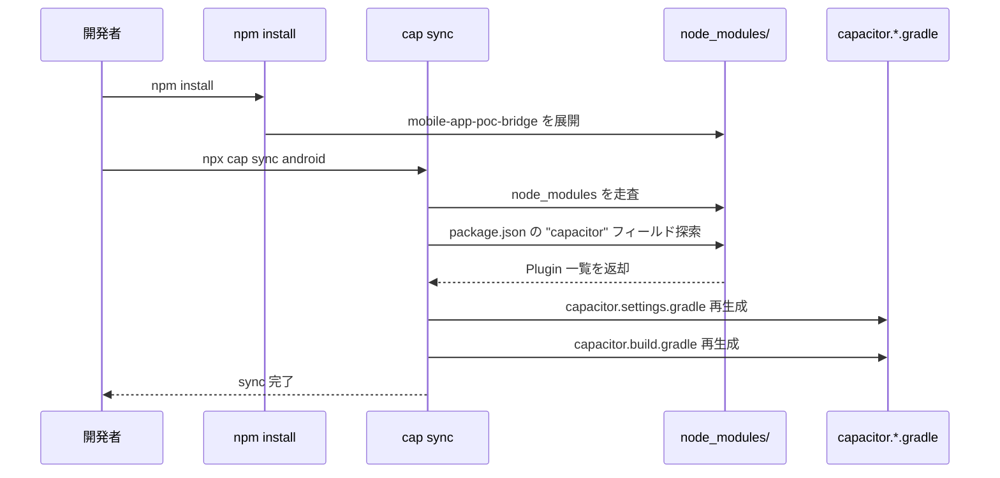

### Q5-4. cap sync 忘れの症状

| 変更内容 | cap sync 忘れたら |
|---|---|
| Vue を修正した | APK 内 assets/public/ が古いまま → 画面が変わらない |
| bridge に新メソッド追加 | TS では見えるが実行時 `"Plugin not implemented"` エラー |
| 新しい Plugin を npm install | Gradle が Plugin を見つけられず `Could not find` エラー |
| AAR を差替えた | 古い AAR のクラスが参照される |

### `cap sync` と `cap sync android` の違い

- `cap sync` (no target): iOS + Android 両方
- `cap sync android`: Android のみ（本 PoC はこちら）

### この章で覚えるべき3点

1. `cap sync` は **Vue 成果物のコピー + Gradle 設定の再生成** の 2 本立て
2. `capacitor.settings.gradle` / `capacitor.build.gradle` は **自動生成ファイル**。手で編集しない
3. Plugin や Vue を変更したら **反射的に cap sync**

---

## 第6章: Gradle ビルドの全体フロー

### この章で答える問い

- Q6-1. Capacitor が作った Android プロジェクトのモジュール構成は
- Q6-2. `:app` と `:mobile-app-poc-bridge` はどう繋がっているか
- Q6-3. AAR の中身は APK のどの段階で合流するか
- Q6-4. `./gradlew` と Android Studio、どちらで叩くべきか

### Q6-1/Q6-2. マルチプロジェクト Gradle 構成

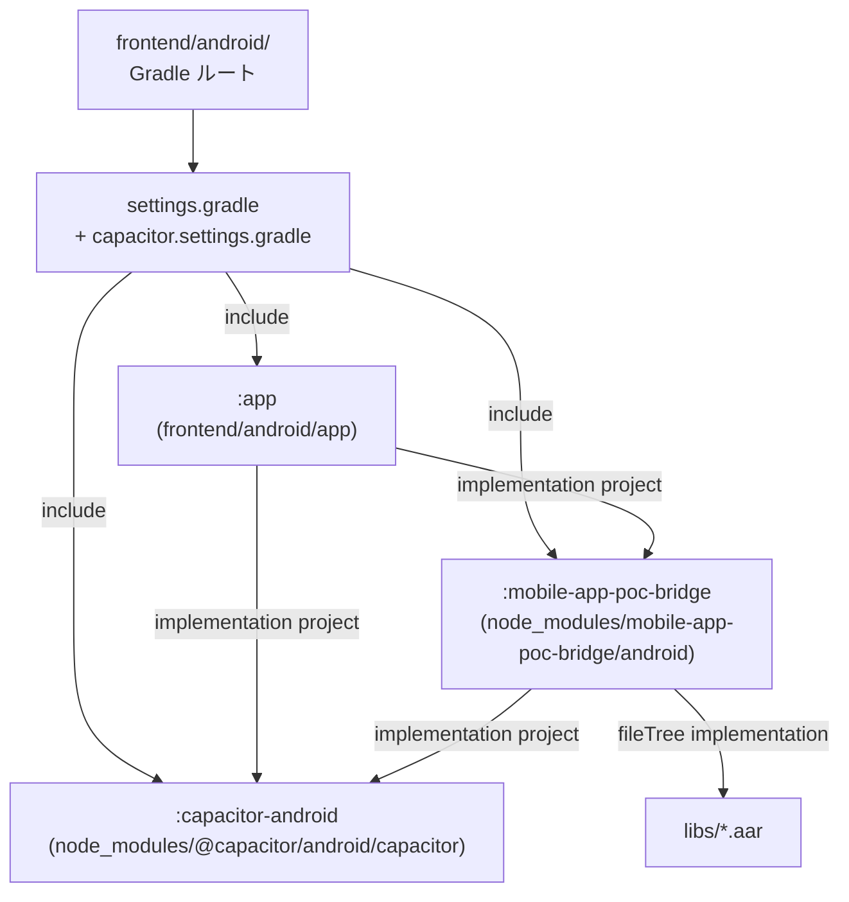

ポイント:
- **ルートは `frontend/android/`**。bridge は**サブプロジェクト**として参加する
- `:app` は frontend のアプリ本体。ここから他モジュールを呼ぶ
- `:mobile-app-poc-bridge` は `node_modules/` 内の bridge を Gradle が直接見に行く
- AAR は `:mobile-app-poc-bridge` の中で閉じている

### Q6-3. ビルドタスク時系列（主要タスクのみ）

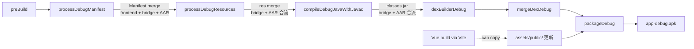

**合流ポイント整理**:

| 合流対象 | 合流タスク | 最終産物 |
|---|---|---|
| AndroidManifest | `processDebugManifest` | マージ済み AndroidManifest.xml |
| res/ | `processDebugResources` | resources.arsc |
| Java classes | `compileDebugJavaWithJavac` → `dexBuilderDebug` | classes.dex |
| jni/*.so | `mergeJniLibsDebug` | lib/<ABI>/*.so |
| Vue 成果物 | `cap copy` | assets/public/ |
| すべて | `packageDebug` | app-debug.apk |

### Q6-4. `./gradlew` vs Android Studio

| 操作 | コマンド / 操作 | 用途 |
|---|---|---|
| CLI ビルド | `cd android && ./gradlew :app:assembleDebug` | CI や自動化時 |
| Capacitor 経由 CLI | `npx cap build android` | `cap sync` + `assembleDebug` を一発 |
| IDE ビルド | Android Studio → Build → Make Project | デバッグ実行や Logcat 前提 |
| 実機実行 | `npx cap run android` or Android Studio Run | 実機接続時 |
| Live Reload | `npx cap run android --livereload --external` | 実機で Vue を即時反映 |

### Windows 固有の注意

- `gradle.properties` の `org.gradle.jvmargs=-Xmx4096m` を増やすと OOM 回避
- JAVA_HOME は JDK 17 を指す（Capacitor 6 前提）
- パス長 260 文字制限対策: `git config --system core.longpaths true`
- 改行コード CRLF 混入で Gradle ファイルが壊れないように `.gitattributes` で `*.gradle text eol=lf`

### Live Reload の仕組み（補足）

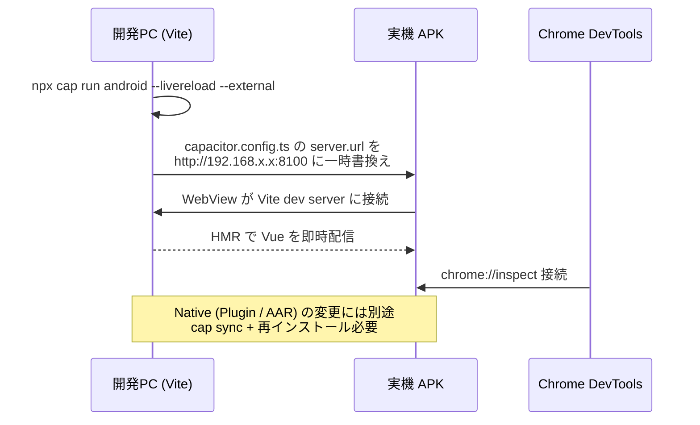

注意: **Live Reload で即時反映されるのは Vue だけ**。bridge を変更したら再ビルド + 再インストール。

### この章で覚えるべき3点

1. Gradle ルートは frontend 側で、bridge はサブプロジェクトとして合流
2. AAR は `processDebugManifest` / `processDebugResources` / `compileDebugJavaWithJavac` の各段階で溶ける
3. 日常は Android Studio、自動化時は `./gradlew` or `cap build android`

---

## 第7章: ランタイムシーケンス（JS → Native → AAR）

### この章で答える問い

- Q7-1. JS で `DeviceBridge.scan()` を呼んだ瞬間、何が起きているのか
- Q7-2. 非同期パターンはどう使い分けるか
- Q7-3. イベント通知 (`notifyListeners`) はどう届くか
- Q7-4. スレッド境界・UI スレッド越境はどこで起きるか

### Q7-1. 呼出しシーケンス（request/response 型）

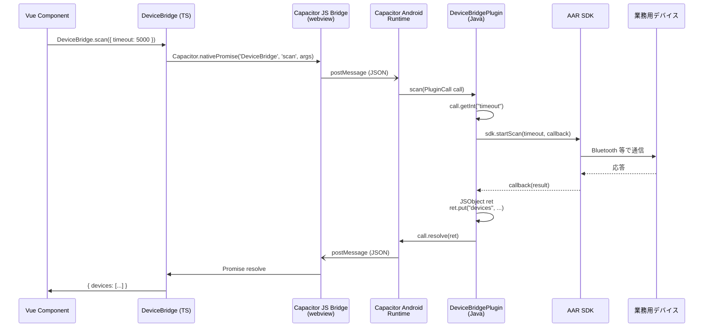

**要点**:
- JS ↔ Native の越境は `postMessage` ベース（JSON 文字列）
- 引数は `call.getString / getInt / getObject` で取り出す
- 戻り値は `JSObject` に詰めて `call.resolve(ret)`
- 例外時は `call.reject("message", errorCode, exception)`

### Q7-2. 非同期パターン 3 種の使い分け

| パターン | 用途 | Plugin 側 | JS 側 |
|---|---|---|---|
| **一問一答** | scan, connect, getStatus | `call.resolve(ret)` 1回 | `await scan()` |
| **進捗通知 + 完了** | ファイル転送、長時間スキャン | `notifyListeners("progress", ...)` + 最後に `call.resolve()` | `addListener + await` 併用 |
| **継続イベント** | 接続状態変化、受信データ | `notifyListeners("deviceStatus", ...)` のみ | `addListener` で購読、`remove` で解除 |

### Q7-3. イベント通知シーケンス

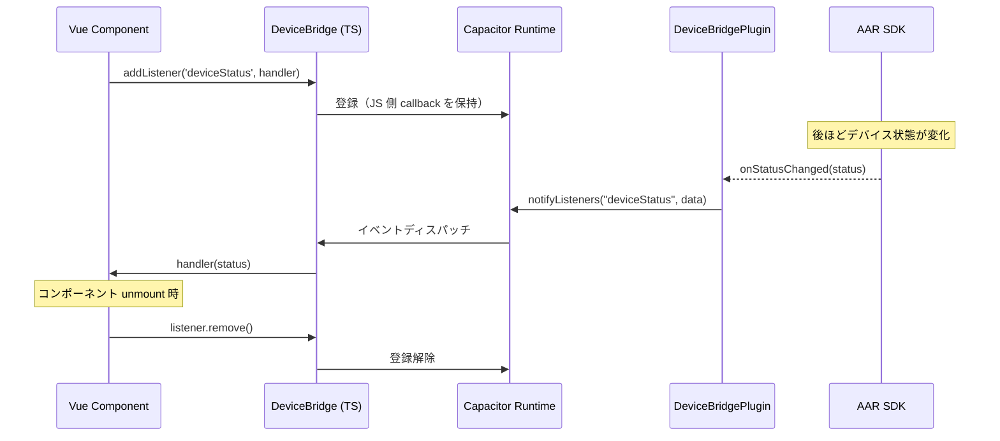

**注意**:
- `addListener` は Promise を返し、`PluginListenerHandle` で `remove()` できる
- **unmount 時に remove しないとメモリリーク**。`onUnmounted` で呼ぶ

### Q7-4. スレッド境界

AAR のコールバックが **別スレッド（AAR 内部のワーカー）**から来るケースが多い。UI 更新を伴う場合は UI スレッドに戻す:

```java
getActivity().runOnUiThread(() -> {
    JSObject data = new JSObject();
    data.put("status", status);
    notifyListeners("deviceStatus", data);
});
```

Capacitor 自身は `notifyListeners` を主スレッドから呼ばれる前提では設計されていない（内部で適切に扱う）ので必須ではないが、AAR 側の UI 更新コードを混ぜる場合は要考慮。

### JS 側ラッパーの典型パターン

```ts
// src/index.ts
import { registerPlugin } from '@capacitor/core';
import type { DeviceBridgePlugin } from './definitions';

const DeviceBridge = registerPlugin<DeviceBridgePlugin>('DeviceBridge', {
  web: () => import('./web').then(m => new m.DeviceBridgeWeb()),
});

export * from './definitions';
export { DeviceBridge };
```

```ts
// src/definitions.ts
import type { PluginListenerHandle } from '@capacitor/core';

export interface DeviceStatus { connected: boolean; battery: number; }

export interface DeviceBridgePlugin {
  scan(options: { timeout: number }): Promise<{ devices: string[] }>;
  connect(options: { deviceId: string }): Promise<void>;
  disconnect(): Promise<void>;
  getStatus(): Promise<DeviceStatus>;
  addListener(
    eventName: 'deviceStatus',
    listener: (status: DeviceStatus) => void,
  ): Promise<PluginListenerHandle>;
}
```

### エラー経路

```
AAR が例外投げる
  → Plugin で catch
  → call.reject("scan_failed", "TIMEOUT", ex)
  → JS 側で reject された Promise
  → Vue 側 try/catch で捕捉
  → ユーザー通知
```

`PluginCall.reject` の第2引数 `code` は frontend 側で分岐に使える:

```ts
try {
  await DeviceBridge.scan({ timeout: 5000 });
} catch (e: any) {
  if (e.code === 'TIMEOUT') { /* タイムアウト分岐 */ }
}
```

### この章で覚えるべき3点

1. JS ↔ Native は `postMessage` の JSON 越境。型は自分で守る
2. **request/response**・**進捗**・**継続イベント** の 3 パターンを使い分ける
3. Listener は必ず `remove()` する。AAR コールバックは別スレッドかもしれない

---

## 第8章: デバッグ動線

### 3層デバッグツリー

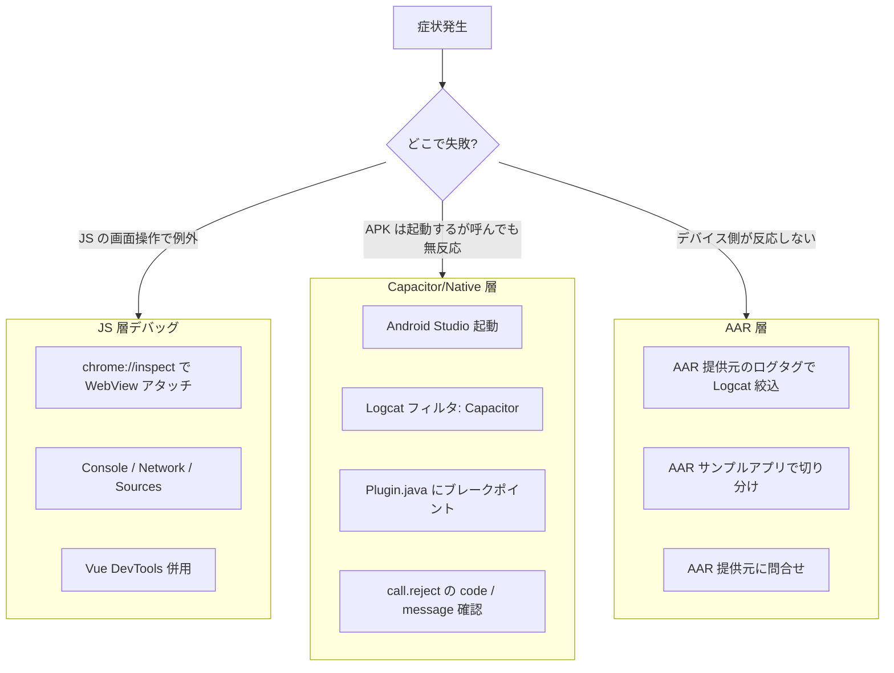

### JS 層: Chrome DevTools

1. 実機を USB 接続し、開発者オプション → USB デバッグ ON
2. `adb devices` で認識確認
3. Chrome で `chrome://inspect` を開く
4. "Remote Target" に WebView が出る → `inspect`
5. 通常の Chrome DevTools が使える（Console, Network, Sources）

**見えるもの**:
- `console.log` の出力
- `fetch` / `CapacitorHttp` のリクエスト（※ CapacitorHttp は Native 経由なので Network タブに全部は出ない）
- Vue 側の例外スタック

### Capacitor/Native 層: Logcat

Android Studio の Logcat でフィルタ:

```
package:mine  tag:Capacitor
```

重要タグ:
- `Capacitor` / `Capacitor/Plugin` — 呼出し検知、未実装 Plugin
- `CapacitorJS` — WebView 側から Native への橋
- `AndroidRuntime` — Java 例外スタック

adb でのフィルタ:

```bash
adb logcat -s Capacitor:* AndroidRuntime:* System.err:*
```

### AAR 層

AAR 提供元が独自のログタグを持つことが多い:

```bash
adb logcat -s DeviceSdk:*   # AAR 提供元のタグに合わせる
```

AAR の不具合切分け手順:
1. AAR 提供元の **サンプルアプリ（独立した Android アプリ）**で再現するか
2. 再現する → AAR 側の問題。提供元に問合せ
3. 再現しない → bridge の呼出し方・初期化順序の問題

### スタックトレースの読み方早見表

| 識別子 | 由来 | 対処先 |
|---|---|---|
| `com.getcapacitor.*` | Capacitor ランタイム | Capacitor バージョン・cap sync 状態 |
| `<bridge の package id>.*` | 自作 Plugin | bridge のロジック |
| AAR 提供元のパッケージ | AAR 内部 | AAR 提供元 / 呼出し引数 |
| `android.*` / `java.*` | OS / JDK | 権限・SDK バージョン・JNI |

### Live Reload とデバッグの相性

- Live Reload 中でも Chrome DevTools でアタッチ可能
- ブレークポイントは Live Reload のソースマップが効けば TS のまま貼れる
- **Plugin の変更は Live Reload では反映されない**。再 install 必須

### この章で覚えるべき3点

1. **症状 → 層の特定**が最初。JS / Native / AAR の 3 階で考える
2. `chrome://inspect` と `Logcat` の**2本立て**
3. AAR の不具合疑いは**提供元サンプルで再現確認**が最速

---

## 第9章: バージョン運用と配布

### この章で答える問い

- Q9-1. bridge のバージョンは何で表現するか
- Q9-2. AAR が更新されたときの波及範囲は
- Q9-3. 社内 git 参照でのバージョンピン留め方法は
- Q9-4. パブリック npm へ公開するリスクは

### Q9-1. バージョン表現

bridge の `package.json` の `version` フィールド（semver）+ **git tag** を併用。

```json
{ "name": "mobile-app-poc-bridge", "version": "0.1.0" }
```

```bash
git tag v0.1.0
git push origin v0.1.0
```

**社内環境では semver より commit SHA / tag のほうが確実にピン留めできる**。

### Q9-2. 更新の伝播

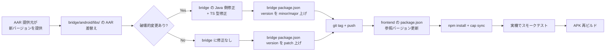

### Q9-3. 社内 git 参照のピン留め

**tag 指定（推奨）**:

```json
{
  "dependencies": {
    "mobile-app-poc-bridge": "git+ssh://git@internal-git/org/mobile-app-poc-bridge.git#v0.1.0"
  }
}
```

**commit SHA 指定（最も厳密）**:

```json
{
  "dependencies": {
    "mobile-app-poc-bridge": "git+ssh://git@internal-git/org/mobile-app-poc-bridge.git#abc1234"
  }
}
```

**branch 指定（開発中のみ、リリースには使わない）**:

```json
{
  "dependencies": {
    "mobile-app-poc-bridge": "git+ssh://git@internal-git/org/mobile-app-poc-bridge.git#develop"
  }
}
```

### Q9-4. パブリック npm へ公開しない理由

- AAR 提供元の**ライセンス**が社外配布を禁じている可能性
- 業務用デバイスの API を公開することで**攻撃ベクトル**を広げる
- 社内固有の命名・識別子が漏れる

→ **本 PoC はパブリック npm 公開禁止**。`.npmignore` とは別に、公開手順自体を運用で禁止する。

### 将来の選択肢（PoC 完了後）

| 方式 | 特徴 |
|---|---|
| **verdaccio** 社内ホスト | 軽量な private npm registry。Docker または nodejs で立てる |
| **Artifactory / Nexus** | 既に社内にあれば利用。npm / Maven 両対応 |
| **GitHub Packages（企業プラン）** | GitHub 認証と連携 |
| **Azure Artifacts** | Azure DevOps を使っていれば |

### この章で覚えるべき3点

1. bridge version = `package.json` + **git tag** のペアで管理
2. AAR 差替えは **patch/minor/major のどれに該当するか**を毎回判断
3. PoC はパブリック npm 禁止。**社内 git 直参照**を標準に

---

## 第10章: 落とし穴と対策

### 症状 → 原因 → 対処 早見表

| 症状 | 発生場所 | 原因 | 対処 | 関連章 |
|---|---|---|---|---|
| `Plugin not implemented` | JS 実行時 | cap sync してない / 古い APK | `cap sync android` + Android Studio で再ビルド | 第5章 |
| `Could not find :mobile-app-poc-bridge` | Gradle sync | `capacitor.settings.gradle` が古い | `cap sync` 実行、`node_modules/mobile-app-poc-bridge` の存在確認 | 第5章 |
| `ClassNotFoundException` at runtime | 実行時 Logcat | AAR が libs に無い or `fileTree` 依存抜け | `android/libs/` 確認、`build.gradle` dependencies 確認 | 第3章 |
| `Duplicate class ...` | `compileDebugJavaWithJavac` | AAR と他依存の二重取込み | `exclude group: 'com.example'` で片方除外 | 第3章 |
| `INSTALL_FAILED_NO_MATCHING_ABIS` | `adb install` | AAR が `arm64-v8a` only、エミュが x86 | 実機を使う or `abiFilters` 指定 | 第3章 |
| `AAPT: resource collision` | `processDebugResources` | AAR と frontend の res 名衝突 | res に prefix 付与、AAR 提供元に命名相談 | 第3章 |
| `minSdkVersion 違反` | Gradle sync | AAR が要求する minSdk が高い | `android/variables.gradle` の `minSdkVersion` を上げる | 第6章 |
| ProGuard 後に AAR が動かない | リリースビルド時のみ | R8/ProGuard で AAR クラスが削除 | `android/app/proguard-rules.pro` に `-keep class <aar_package>.** { *; }` | 第8章 |
| CORS / mixed content | WebView で fetch 失敗 | HTTP を WebView から叩けない | `capacitor.config.ts` の `server.androidScheme: 'https'` 等調整、CapacitorHttp を使う | — |
| Live Reload 繋がらない | 実機で白画面 | PC と実機の LAN 分離 / FW ブロック | 同一 LAN 確認、Windows Defender で 8100 許可 | 第6章 |
| Windows パス長エラー | `npm install` / Gradle | 260 文字制限 | `git config --system core.longpaths true`、プロジェクトをパス浅い場所へ | 第6章 |
| `.gradle` ファイル壊れる | Gradle sync | CRLF 混入 | `.gitattributes` に `*.gradle text eol=lf` | 第6章 |
| `PluginListener が発火しない` | JS で addListener したのに無音 | AAR のコールバックが別スレ / `notifyListeners` 忘れ | Logcat で Plugin 側のコールバック到達確認 | 第7章 |
| メモリリーク警告 | 長時間使用 | Listener の `remove` 忘れ | `onUnmounted` で `listener.remove()` | 第7章 |
| `npm link` で Plugin が認識されない | `cap sync` 後 | symlink を AGP が辿れない | `"file:../mobile-app-poc-bridge"` に切替 | 第4章 |
| `OutOfMemoryError` Gradle | Gradle 実行時 | JVM ヒープ不足 | `gradle.properties` で `org.gradle.jvmargs=-Xmx4096m` | 第6章 |
| Android Studio が sync ループ | IDE | キャッシュ破損 | `File → Invalidate Caches and Restart` | 第6章 |
| 実機で `Plugin` 呼んだ瞬間即死 | Logcat に `NoClassDefFoundError` | ProGuard / R8 が AAR の内部クラスを消した | keep ルール追加 | 第3章 |

### 重要ポイント（選りすぐり）

#### ① ProGuard / R8 によるクラス削除

リリースビルド（`assembleRelease`）だけで発生。debug では再現しない。

```proguard
# frontend/android/app/proguard-rules.pro
-keep class <AAR提供元の package 名>.** { *; }
-dontwarn <AAR提供元の package 名>.**
```

#### ② Manifest の権限マージ順序

AAR の Manifest の権限が frontend の Manifest に波及するが、`tools:node="remove"` で打ち消される場合がある。マージ結果は以下で確認:

```
frontend/android/app/build/intermediates/merged_manifests/debug/AndroidManifest.xml
```

#### ③ Capacitor 6 の AGP / JDK 要件

- **AGP 8.2.1** が Capacitor 6 の推奨
- **JDK 17** 必須（Gradle が 17 未満で fail）
- `JAVA_HOME` の設定忘れに注意。Android Studio 内蔵 JDK を使うなら `%PROGRAMFILES%/Android/Android Studio/jbr` を指す

### この章で覚えるべき3点

1. **`Plugin not implemented` = cap sync 忘れの代名詞**
2. **debug では出ないが release で死ぬ**パターン（R8/ProGuard）を必ず確認してから配布
3. Windows 固有の落とし穴（CRLF / パス長 / FW）は **事前チェックリスト化**

---

## 付録A: 逆引きインデックス

症状・疑問から本編へジャンプする索引。

### ビルドで失敗する系

- 「bridge を npm install しても Android に反映されない」→ [第5章](#第5章-npx-cap-sync-の内部動作)
- 「Gradle sync が失敗する」→ [第6章](#第6章-gradle-ビルドの全体フロー) / [第10章](#第10章-落とし穴と対策)
- 「Duplicate class エラーが出る」→ [第3章](#第3章-aar-を-bridge-に組み込む) / [第10章](#第10章-落とし穴と対策)
- 「minSdk 違反」→ [第3章](#第3章-aar-を-bridge-に組み込む) / [第6章](#第6章-gradle-ビルドの全体フロー)
- 「release ビルドだけ失敗する」→ [第10章](#第10章-落とし穴と対策)（ProGuard）
- 「Windows で npm install / Gradle が OOM」→ [第6章](#第6章-gradle-ビルドの全体フロー)
- 「パス長エラー」→ [第10章](#第10章-落とし穴と対策)

### 実行時に失敗する系

- 「JS で呼んだら `Plugin not implemented`」→ [第5章](#第5章-npx-cap-sync-の内部動作) / [第10章](#第10章-落とし穴と対策)
- 「Java 例外で落ちる」→ [第8章](#第8章-デバッグ動線)
- 「AAR が反応しない」→ [第7章](#第7章-ランタイムシーケンスjs--native--aar) / [第8章](#第8章-デバッグ動線)
- 「Listener が発火しない」→ [第7章](#第7章-ランタイムシーケンスjs--native--aar)
- 「INSTALL_FAILED_NO_MATCHING_ABIS」→ [第3章](#第3章-aar-を-bridge-に組み込む)

### 設計・運用で迷う系

- 「bridge を frontend にどう繋ぐか」→ [第4章](#第4章-bridge-を-frontend-へ取り込む3方式)
- 「AAR 更新をどうリリースするか」→ [第9章](#第9章-バージョン運用と配布)
- 「Live Reload はどこまで効くか」→ [第6章](#第6章-gradle-ビルドの全体フロー) / [第8章](#第8章-デバッグ動線)
- 「非同期パターンをどう選ぶか」→ [第7章](#第7章-ランタイムシーケンスjs--native--aar)
- 「npm link は使っていいか」→ [第4章](#第4章-bridge-を-frontend-へ取り込む3方式)

### 概念がわからない系

- 「Capacitor と Ionic の違い」→ [Q0-1](#q0-1-そもそも-capacitor-とは何かionic--cordova-との違いは)
- 「Custom Plugin とは」→ [Q0-2](#q0-2-custom-plugin-とは標準-plugin-と何が違う) / [第2章](#第2章-bridge-リポジトリの構造)
- 「AAR とは」→ [Q0-3](#q0-3-aar-とは何か-jar--android-library-との違いは) / [第3章](#第3章-aar-を-bridge-に組み込む)
- 「cap sync の意味」→ [Q0-7](#q0-7-cap-sync-は何のために毎回必要なのか) / [第5章](#第5章-npx-cap-sync-の内部動作)

---

## 付録B: 用語集

### Capacitor 関連

- **Capacitor**: Ionic Team の Web → Native 実行ランタイム。WebView ラッパーと Plugin 機構を提供
- **@capacitor/cli**: Capacitor 操作の CLI。`cap sync`, `cap run`, `plugin:generate` 等を提供
- **@capacitor/core**: Capacitor の JS 側コアライブラリ。`registerPlugin`, `Plugins` を提供
- **@capacitor/android**: Android 側ランタイム。Gradle サブプロジェクト `:capacitor-android` として frontend に組込まれる
- **Custom Plugin**: 自作 Plugin。`@capacitor/cli plugin:generate` で雛形生成
- **Plugin**: JS から呼べるネイティブ機能の単位
- **PluginCall**: JS からの呼出しを表す Java オブジェクト。引数取得と `resolve/reject` API を持つ
- **@CapacitorPlugin**: Plugin クラスに付与する Java アノテーション。`name` が JS 側識別子
- **@PluginMethod**: JS から呼べる Java メソッドに付与するアノテーション
- **notifyListeners**: Plugin から JS へイベントを push する API
- **PluginListenerHandle**: JS 側で返される Listener のハンドル。`remove()` で解除
- **capacitor.config.ts**: Capacitor 全体設定ファイル
- **capacitor.settings.gradle / capacitor.build.gradle**: cap sync が自動生成する Gradle 設定

### Android / Gradle 関連

- **AAR (Android Archive)**: Android 専用のライブラリ配布形式。`.aar` 拡張子
- **JAR (Java Archive)**: Java クラスのみを含む汎用アーカイブ
- **APK (Android Package)**: Android アプリの実行形式
- **AAB (Android App Bundle)**: Google Play 向けの配布形式。本 PoC では使わない
- **AGP (Android Gradle Plugin)**: Gradle の Android 用プラグイン。Capacitor 6 は AGP 8.2.1
- **Gradle**: ビルドランナー。Groovy / Kotlin DSL
- **`./gradlew`**: Gradle Wrapper。プロジェクトごとの Gradle を起動する
- **settings.gradle**: マルチプロジェクト構成を定義
- **build.gradle**: モジュールごとのビルド設定
- **AndroidManifest.xml**: 権限・コンポーネント宣言
- **Manifest merge**: 複数の AndroidManifest.xml を 1 つに統合する AGP の機構
- **R8 / ProGuard**: コード縮小・難読化。release ビルドで有効
- **minSdkVersion**: アプリが対応する最低 Android API レベル
- **ABI (Application Binary Interface)**: ネイティブコードのアーキテクチャ。`arm64-v8a`, `armeabi-v7a`, `x86_64` など
- **JNI**: Java Native Interface。Java から .so を呼ぶ仕組み（本 PoC の主眼ではない）
- **Logcat**: Android OS のログストリーム

### 開発ツール

- **Android Studio**: Android 開発用 IDE
- **ADB (Android Debug Bridge)**: デバイスと通信する CLI
- **Chrome DevTools**: Chrome が提供する Web デバッガ。WebView にもアタッチ可能
- **Vite**: フロントエンドのビルドツール
- **Vue**: UI フレームワーク
- **Ionic**: モバイル向け UI コンポーネント
- **Pinia**: Vue の状態管理
- **CapacitorHttp**: Capacitor 標準の HTTP Plugin。CORS を回避できる
- **Live Reload**: 開発中に変更を実機に即時反映する仕組み

---

## 付録C: 参考リンク

### 公式

- Capacitor 公式サイト: https://capacitorjs.com/
- Capacitor Custom Plugin ガイド: https://capacitorjs.com/docs/plugins/creating-plugins
- Capacitor Android ガイド: https://capacitorjs.com/docs/android
- Ionic Vue: https://ionicframework.com/docs/vue/overview
- Android Developer - AAR: https://developer.android.com/studio/projects/android-library
- Android Gradle Plugin リリースノート: https://developer.android.com/build/releases/gradle-plugin

### 本書の関連ドキュメント

- マスター設計: `docs/superpowers/specs/2026-04-19-mobile-app-poc-master-design.md`
- bridge 原典プロンプト: `docs/5. mobile-app-poc-bridge.md`
- frontend 原典プロンプト: `docs/4. mobile-app-poc-frontend.md`

### 補足が欲しい場合

- Capacitor Community Plugins: https://github.com/capacitor-community
- Capacitor Issues: https://github.com/ionic-team/capacitor/issues
- Ionic Forum: https://forum.ionicframework.com/

---

## 付録D: 本書の想定外・今後の課題

- **iOS 対応**: スコープ外。将来必要になれば `ios/` 側の Podspec / Swift 実装を調査
- **BLE/USB 等プロトコル詳細**: AAR が抽象化してくれている前提。AAR の API が露出する場合は別途調査
- **Capacitor 7 / 8 への追従**: AGP / JDK 要件が変わる。マイグレーションガイドを参照
- **動的権限の UI**: `requestPermissionForAlias` の詳細は Vue 側の UX 検討が必要
- **テスト戦略**: Plugin の単体テスト、CI でのビルドまでは本 PoC のスコープ外

---

*本書は `docs/superpowers/specs/` 配下の他ドキュメントと同じく、将来の変更を前提とした生きた資料として扱う。bridge 実装中に判明した知見は本書に追記し、PoC 完了後に再編集する。*
